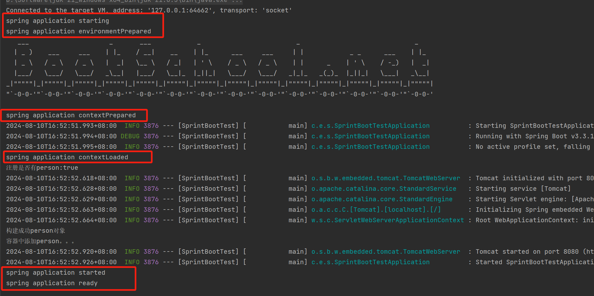
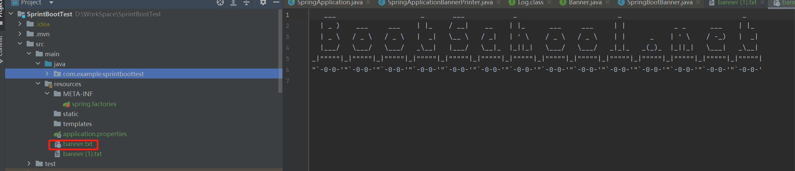
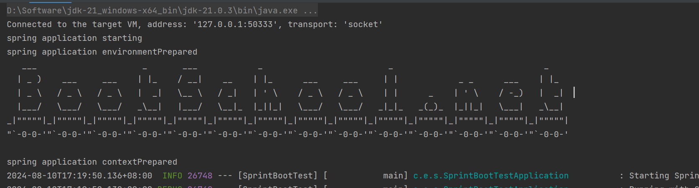

## SpringBoot3启动过程

本文采用Springboot 3.3.1版本，分析springboot3 的启动过程

```java
@SpringBootApplication
public class SprintBootTestApplication {

    public static void main(String[] args) {
        SpringApplication.run(SprintBootTestApplication.class, args);
    }
}
```

进入run方法：

```java
public static ConfigurableApplicationContext run(Class<?>[] primarySources, String[] args) {
    return new SpringApplication(primarySources).run(args);
}
```
<a id="begin"></a>

上次讲完了SpringBoot的初始化过程，接下来开始讲run方法的执行过程：

```java
public ConfigurableApplicationContext run(String... args) {
    // 创建一个Startup对象，用于记录启动过程的时间
    Startup startup = Startup.create();
    // 如果设置了注册关闭钩子，则启用关闭钩子的添加,用于优雅关闭SpringBoot应用
    if (this.registerShutdownHook) {
        SpringApplication.shutdownHook.enableShutdownHookAddition();
    }
    // 创建一个默认的引导上下文
    DefaultBootstrapContext bootstrapContext = createBootstrapContext();
    // 初始化上下文变量
    ConfigurableApplicationContext context = null;
    // 配置无头模式属性，确保在没有图形用户界面的环境中可以正常运行
    configureHeadlessProperty();
    // 获取运行监听器
    SpringApplicationRunListeners listeners = getRunListeners(args);
    // 通知监听器开始启动,遍历执行每个监听器的starting方法，可以进行自定义
    listeners.starting(bootstrapContext, this.mainApplicationClass);
    try {
        // 解析命令行参数
        ApplicationArguments applicationArguments = new DefaultApplicationArguments(args);
        // 准备环境，包括加载配置文件
        ConfigurableEnvironment environment = prepareEnvironment(listeners, bootstrapContext, applicationArguments);
        // 打印横幅信息
        Banner printedBanner = printBanner(environment);
        // 创建应用上下文
        // 根据web应用类型，创建对应的应用上下文实例
        context = createApplicationContext();
        // 设置启动上下文
        context.setApplicationStartup(this.applicationStartup);
        // 准备上下文，包括初始化Bean
        prepareContext(bootstrapContext, context, environment, listeners, applicationArguments, printedBanner);
        // 刷新上下文，完成Bean的初始化
        refreshContext(context);
        // 上下文刷新后的处理
        afterRefresh(context, applicationArguments);
        // 记录启动阶段
        startup.started();
        // 如果设置了打印启动信息，则打印启动日志
        if (this.logStartupInfo) {
            new StartupInfoLogger(this.mainApplicationClass).logStarted(getApplicationLog(), startup);
        }
        // 通知监听器启动完成
        listeners.started(context, startup.timeTakenToStarted());
        // 调用Runner接口的实现类
        callRunners(context, applicationArguments);
    }
    catch (Throwable ex) {
        throw handleRunFailure(context, ex, listeners);
    }
    try {
        // 如果上下文正在运行，则通知监听器准备好
        if (context.isRunning()) {
            listeners.ready(context, startup.ready());
        }
    }
    catch (Throwable ex) {
        // 处理准备好阶段失败的情况
        throw handleRunFailure(context, ex, null);
    }
    // 返回创建的应用上下文
    return context;
}
```
[跳转getRunListeners方法解析](#1)

[跳转DefaultApplicationArguments方法解析](#2)

[跳转prepareEnvironment方法解析](#3)

[跳转printBanner方法解析](#4)

[跳转prepareContext方法解析](#5)

1.createBootstrapContext()方法解析：

```java
private DefaultBootstrapContext createBootstrapContext() {
		//生成默认引导上下文
		DefaultBootstrapContext bootstrapContext = new DefaultBootstrapContext();
		//遍历引导注册初始化器，进行初始化操作
		this.bootstrapRegistryInitializers.forEach((initializer) -> initializer.initialize(bootstrapContext));
		return bootstrapContext;
	}
```
我们知道bootstrapRegistryInitializers这个是从META-INF/spring.factories中得到的，那么就可以先设计一个类来实现BootstrapRegistryInitializer接口，然后将此类写到META-INF/spring.factories中，实现自己定制化。
举例说明下，编写一个MyInitializer类来实现BootstrapRegistryInitializer接口

```java
public class MyInitializer implements BootstrapRegistryInitializer {
    @Override
    public void initialize(BootstrapRegistry registry) {
        System.out.println("1111111111111111111");
    }
}
```
在资源文件夹下增加META-INF/spring.factories，并增加配置如下：


运行程序打印结果，可以看到MyInitializer中的initialize方法已执行：


<a id="1"></a>getRunListeners方法解析：

```java
//整个方法是在注册运行监听器，并返回监听器列表
private SpringApplicationRunListeners getRunListeners(String[] args) {
    //获取参数解析器
    ArgumentResolver argumentResolver = ArgumentResolver.of(SpringApplication.class, this);
    argumentResolver = argumentResolver.and(String[].class, args);
    //从META-INF/spring.factories中获取SpringApplicationRunListener列表
    List<SpringApplicationRunListener> listeners = getSpringFactoriesInstances(SpringApplicationRunListener.class,
                                                                               argumentResolver);
    //允许外部组件在启动时插入额外的逻辑，在applicationHook中进行设定
    SpringApplicationHook hook = applicationHook.get();
    //如果钩子不为空，则将钩子提供的监听器添加到监听器列表中
    SpringApplicationRunListener hookListener = (hook != null) ? hook.getRunListener(this) : null;
    if (hookListener != null) {
        listeners = new ArrayList<>(listeners);
        listeners.add(hookListener);
    }
    return new SpringApplicationRunListeners(logger, listeners, this.applicationStartup);
}
```

可以自定义一个类来实现SpringApplicationRunListener接口，在调用starting等方法时执行自定义逻辑，下面举例说明：

```java
public class MySpringRunListener implements SpringApplicationRunListener {
    @Override
    public void starting(ConfigurableBootstrapContext bootstrapContext) {
        System.out.println("spring application starting");
    }

    @Override
    public void environmentPrepared(ConfigurableBootstrapContext bootstrapContext, ConfigurableEnvironment environment) {
        System.out.println("spring application environmentPrepared");
    }

    @Override
    public void contextPrepared(ConfigurableApplicationContext context) {
        System.out.println("spring application contextPrepared");
    }

    @Override
    public void contextLoaded(ConfigurableApplicationContext context) {
        System.out.println("spring application contextLoaded");
    }

    @Override
    public void started(ConfigurableApplicationContext context, Duration timeTaken) {
        System.out.println("spring application started");
    }

    @Override
    public void ready(ConfigurableApplicationContext context, Duration timeTaken) {
        System.out.println("spring application ready");
    }

    @Override
    public void failed(ConfigurableApplicationContext context, Throwable exception) {
        System.out.println("spring application failed");
    }
}
```

和上述类似，在资源文件夹下增加META-INF/spring.factories，并增加配置如下，就可以将自定义监听器注册进去：

```properties
org.springframework.boot.SpringApplicationRunListener=com.example.sprintboottest.test.MySpringRunListener
```



<a id="2"></a>DefaultApplicationArguments方法解析：

```java
public DefaultApplicationArguments(String... args) {
    Assert.notNull(args, "Args must not be null");
    this.source = new Source(args);
    this.args = args;
}
//深入进Source类
private static class Source extends SimpleCommandLinePropertySource {

    Source(String[] args) {
        super(args);
    }
    /*
    * 省略代码
    */
}
//进入super(args)
public class SimpleCommandLinePropertySource extends CommandLinePropertySource<CommandLineArgs> {
    //通过构造函数中SimpleCommandLineArgsParser的parse方法对命令行参数进行了解析
    public SimpleCommandLinePropertySource(String... args) {
        super(new SimpleCommandLineArgsParser().parse(args));
    }
}
//
class SimpleCommandLineArgsParser {
    //基于给定的规则来解析返回命令行参数
    public CommandLineArgs parse(String... args) {
        CommandLineArgs commandLineArgs = new CommandLineArgs();
        for (String arg : args) {
            //参数以“--”开头， 比如：--foo=bar
            if (arg.startsWith("--")) {
                //先获取到参数，例如foo=bar
                String optionText = arg.substring(2);
                String optionName;
                String optionValue = null;
                //对参数进行分割
                int indexOfEqualsSign = optionText.indexOf('=');
                if (indexOfEqualsSign > -1) {
                    //分割出参数名和参数值,比如--foo=bar参数名为foo,参数值为bar
                    optionName = optionText.substring(0, indexOfEqualsSign);
                    optionValue = optionText.substring(indexOfEqualsSign + 1);
                }
                //选项名称就是参数，没有带有值，比如 --foo
                else {
                    optionName = optionText;
                }
                //名称为空，则说明参数不合法
                if (optionName.isEmpty()) {
                    throw new IllegalArgumentException("Invalid argument syntax: " + arg);
                }
                commandLineArgs.addOptionArg(optionName, optionValue);
            }
            else {
                //如果不是以“--”开头，则说明是非选项参数，比如myprogram input.txt output.txt
                commandLineArgs.addNonOptionArg(arg);
            }
        }
        return commandLineArgs;
    }
}
```

<a id="3"></a>prepareEnvironment方法解析：

```java
private ConfigurableEnvironment prepareEnvironment(SpringApplicationRunListeners listeners,
                                                   DefaultBootstrapContext bootstrapContext, ApplicationArguments applicationArguments) {
    // 根据web应用类型创建环境，如果有的话就直接返回
    ConfigurableEnvironment environment = getOrCreateEnvironment();
    //配置环境，包括将
    configureEnvironment(environment, applicationArguments.getSourceArgs());
    //将当前环境中的属性源封装到一个特定的属性源中，并将其附加到属性源列表的最前端，以确保这个封装后的属性源在查找属性时具有最高优先级
    ConfigurationPropertySources.attach(environment);
    //监听器执行环境准备完毕对应的操作
    listeners.environmentPrepared(bootstrapContext, environment);
    //默认属性移动到当前环境的最后
    DefaultPropertiesPropertySource.moveToEnd(environment);
    Assert.state(!environment.containsProperty("spring.main.environment-prefix"),
                 "Environment prefix cannot be set via properties.");
    //SpringApplication实例从环境配置中读取并应用spring.main前缀下的配置
    bindToSpringApplication(environment);
    if (!this.isCustomEnvironment) {
        EnvironmentConverter environmentConverter = new EnvironmentConverter(getClassLoader());
        environment = environmentConverter.convertEnvironmentIfNecessary(environment, deduceEnvironmentClass());
    }
    ConfigurationPropertySources.attach(environment);
    return environment;
}

protected void configureEnvironment(ConfigurableEnvironment environment, String[] args) {
    if (this.addConversionService) {
        environment.setConversionService(new ApplicationConversionService());
    }
    //处理环境的配置
    configurePropertySources(environment, args);
    //配置环境
    configureProfiles(environment, args);
}

protected void configurePropertySources(ConfigurableEnvironment environment, String[] args) {
    MutablePropertySources sources = environment.getPropertySources();
    //默认属性不为空，则将被添加或合并到现有的属性源中。这是为了确保框架或应用级别的默认属性可以被覆盖或扩展
    if (!CollectionUtils.isEmpty(this.defaultProperties)) {
        DefaultPropertiesPropertySource.addOrMerge(this.defaultProperties, sources);
    }
    if (this.addCommandLineProperties && args.length > 0) {
        String name = CommandLinePropertySource.COMMAND_LINE_PROPERTY_SOURCE_NAME;
        //生成新的属性集合中，并确保属性加载的优先级，新的命令行参数将优先于以前的命令行参数
        if (sources.contains(name)) {
            PropertySource<?> source = sources.get(name);
            CompositePropertySource composite = new CompositePropertySource(name);
            composite
                .addPropertySource(new SimpleCommandLinePropertySource("springApplicationCommandLineArgs", args));
            composite.addPropertySource(source);
            sources.replace(name, composite);
        }
        else {
            sources.addFirst(new SimpleCommandLinePropertySource(args));
        }
    }
}
```

<a id="4"></a>printBanner方法解析[跳转到起点](#begin)：

经常看到魔改的SpringBoot框架，都会打印自己的Banner，这个Banner是怎么打印的呢？下面来详细讲解下：

```java
private Banner printBanner(ConfigurableEnvironment environment) {
    //如果无需打印Banner, 就直接返回
    if (this.bannerMode == Banner.Mode.OFF) {
        return null;
    }
    ResourceLoader resourceLoader = (this.resourceLoader != null) ? this.resourceLoader
        : new DefaultResourceLoader(null);
    SpringApplicationBannerPrinter bannerPrinter = new SpringApplicationBannerPrinter(resourceLoader, this.banner);
    if (this.bannerMode == Mode.LOG) {
        return bannerPrinter.print(environment, this.mainApplicationClass, logger);
    }
    return bannerPrinter.print(environment, this.mainApplicationClass, System.out);
}
//此处只只摘取了控制台打印的代码片段，在日志中打印的区别仅仅是打印方法，获取Banner方法都是一致的
Banner print(Environment environment, Class<?> sourceClass, PrintStream out) {
    //获取到Banner
    Banner banner = getBanner(environment);
    //打印Banner
    banner.printBanner(environment, sourceClass, out);
    return new PrintedBanner(banner, sourceClass);
}
//如果没有获取到自定义的Banner，就会返回默认的Banner,也就是我们常见的Spring的banner图标
private Banner getBanner(Environment environment) {
    Banner textBanner = getTextBanner(environment);
    if (textBanner != null) {
        return textBanner;
    }
    if (this.fallbackBanner != null) {
        return this.fallbackBanner;
    }
    return DEFAULT_BANNER;
}
//返回对应的Banner资源
private Banner getTextBanner(Environment environment) {
    //BANNER_LOCATION_PROPERTY为spring.banner.location，在配置文件中设置spring.banner.location的banner文件的位置
    String location = environment.getProperty(BANNER_LOCATION_PROPERTY, DEFAULT_BANNER_LOCATION);
    Resource resource = this.resourceLoader.getResource(location);
    try {
        if (resource.exists() && !resource.getURL().toExternalForm().contains("liquibase-core")) {
            return new ResourceBanner(resource);
        }
    }
    catch (IOException ex) {
        // Ignore
    }
    return null;
}
```

可以根据上面的解析，做个试验，在资源文件夹下增加一个banner.txt文件：



在application.properties文件中指明：

```properties
spring.banner.location=banner.txt
```

运行之后可以看到打印Banner成功：



<a id="5"></a>>prepareContext方法解析：

```java
private void prepareContext(DefaultBootstrapContext bootstrapContext, ConfigurableApplicationContext context,
                            ConfigurableEnvironment environment, SpringApplicationRunListeners listeners,
                            ApplicationArguments applicationArguments, Banner printedBanner) {
    context.setEnvironment(environment);
    postProcessApplicationContext(context);
    addAotGeneratedInitializerIfNecessary(this.initializers);
    applyInitializers(context);
    listeners.contextPrepared(context);
    bootstrapContext.close(context);
    if (this.logStartupInfo) {
        logStartupInfo(context.getParent() == null);
        logStartupProfileInfo(context);
    }
    // Add boot specific singleton beans
    ConfigurableListableBeanFactory beanFactory = context.getBeanFactory();
    beanFactory.registerSingleton("springApplicationArguments", applicationArguments);
    if (printedBanner != null) {
        beanFactory.registerSingleton("springBootBanner", printedBanner);
    }
    if (beanFactory instanceof AbstractAutowireCapableBeanFactory autowireCapableBeanFactory) {
        autowireCapableBeanFactory.setAllowCircularReferences(this.allowCircularReferences);
        if (beanFactory instanceof DefaultListableBeanFactory listableBeanFactory) {
            listableBeanFactory.setAllowBeanDefinitionOverriding(this.allowBeanDefinitionOverriding);
        }
    }
    if (this.lazyInitialization) {
        context.addBeanFactoryPostProcessor(new LazyInitializationBeanFactoryPostProcessor());
    }
    if (this.keepAlive) {
        context.addApplicationListener(new KeepAlive());
    }
    context.addBeanFactoryPostProcessor(new PropertySourceOrderingBeanFactoryPostProcessor(context));
    if (!AotDetector.useGeneratedArtifacts()) {
        // Load the sources
        Set<Object> sources = getAllSources();
        Assert.notEmpty(sources, "Sources must not be empty");
        load(context, sources.toArray(new Object[0]));
    }
    listeners.contextLoaded(context);
}
```

