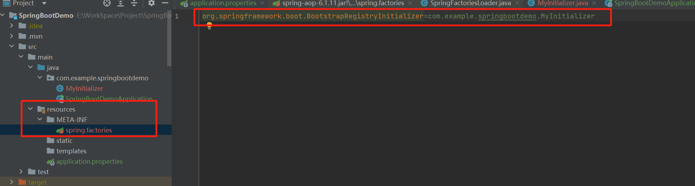
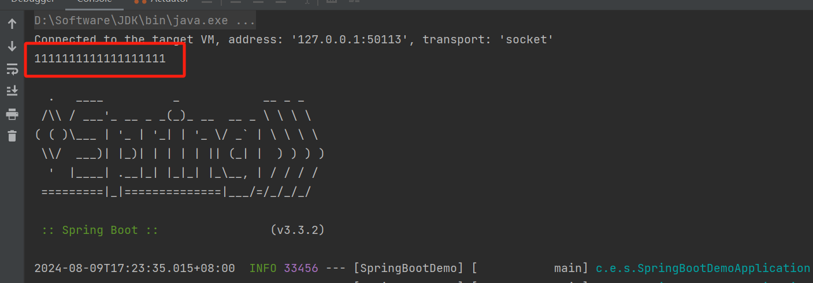

## SpringBoot3启动过程

本文采用Springboot 3.3.1版本，分析springboot3 的启动过程

```java
@SpringBootApplication
public class SprintBootTestApplication {

    public static void main(String[] args) {
        SpringApplication.run(SprintBootTestApplication.class, args);
    }
}
```

进入run方法：

```java
public static ConfigurableApplicationContext run(Class<?>[] primarySources, String[] args) {
    return new SpringApplication(primarySources).run(args);
}
```
上次讲完了SpringBoot的初始化过程，接下来开始讲run方法的执行过程：

```java
public ConfigurableApplicationContext run(String... args) {
    // 创建一个Startup对象，用于记录启动过程的时间
    Startup startup = Startup.create();
    // 如果设置了注册关闭钩子，则启用关闭钩子的添加,用于优雅关闭SpringBoot应用
    if (this.registerShutdownHook) {
        SpringApplication.shutdownHook.enableShutdownHookAddition();
    }
    // 创建一个默认的引导上下文
    DefaultBootstrapContext bootstrapContext = createBootstrapContext();
    // 初始化上下文变量
    ConfigurableApplicationContext context = null;
    // 配置无头模式属性，确保在没有图形用户界面的环境中可以正常运行
    configureHeadlessProperty();
    // 获取运行监听器
    SpringApplicationRunListeners listeners = getRunListeners(args);
    // 通知监听器开始启动
    listeners.starting(bootstrapContext, this.mainApplicationClass);
    try {
        // 解析命令行参数
        ApplicationArguments applicationArguments = new DefaultApplicationArguments(args);
        // 准备环境，包括加载配置文件
        ConfigurableEnvironment environment = prepareEnvironment(listeners, bootstrapContext, applicationArguments);
        // 打印横幅信息
        Banner printedBanner = printBanner(environment);
        // 创建应用上下文
        context = createApplicationContext();
        // 设置启动上下文
        context.setApplicationStartup(this.applicationStartup);
        // 准备上下文，包括初始化Bean
        prepareContext(bootstrapContext, context, environment, listeners, applicationArguments, printedBanner);
        // 刷新上下文，完成Bean的初始化
        refreshContext(context);
        // 上下文刷新后的处理
        afterRefresh(context, applicationArguments);
        // 记录启动阶段
        startup.started();
        // 如果设置了打印启动信息，则打印启动日志
        if (this.logStartupInfo) {
            new StartupInfoLogger(this.mainApplicationClass).logStarted(getApplicationLog(), startup);
        }
        // 通知监听器启动完成
        listeners.started(context, startup.timeTakenToStarted());
        // 调用Runner接口的实现类
        callRunners(context, applicationArguments);
    }
    catch (Throwable ex) {
        throw handleRunFailure(context, ex, listeners);
    }
    try {
        // 如果上下文正在运行，则通知监听器准备好
        if (context.isRunning()) {
            listeners.ready(context, startup.ready());
        }
    }
    catch (Throwable ex) {
        // 处理准备好阶段失败的情况
        throw handleRunFailure(context, ex, null);
    }
    // 返回创建的应用上下文
    return context;
}
```
createBootstrapContext()方法解析：
```java
private DefaultBootstrapContext createBootstrapContext() {
		//生成默认引导上下文
		DefaultBootstrapContext bootstrapContext = new DefaultBootstrapContext();
		//遍历引导注册初始化器，进行初始化操作
		this.bootstrapRegistryInitializers.forEach((initializer) -> initializer.initialize(bootstrapContext));
		return bootstrapContext;
	}
```
我们知道bootstrapRegistryInitializers这个是从META-INF/spring.factories中得到的，那么就可以先设计一个类来实现BootstrapRegistryInitializer接口，然后将此类写到META-INF/spring.factories中，实现自己定制化。
举例说明下，编写一个MyInitializer类来实现BootstrapRegistryInitializer接口

```java
public class MyInitializer implements BootstrapRegistryInitializer {
    @Override
    public void initialize(BootstrapRegistry registry) {
        System.out.println("1111111111111111111");
    }
}
```
在资源文件夹下增加META-INF/spring.factories，并增加配置如下：



运行程序打印结果，可以看到MyInitializer中的initialize方法已执行：

