# 一、初识Docker

在云计算时代，虚拟化技术无疑是整座信息技术大厦最核心的一块基石。

虚拟化既可以通过硬件模拟来实现，也可以通过操作系统来实现。

容器虚拟化技术充分利用操作系统本身的机制和特性，可以实现轻量级的虚拟化，其中Docker就是主要的代表。

Docker通过对应用组件的封装、分发、部署、运行等生命周期的管理，达到应用软件级别的“一次封装，到处运行”。

> 容器技术的准确描述：
>
> 容器有效地将由单个操作系统管理的资源划分到孤立的组中，以便更好地在孤立的组之间平衡有冲突的资源使用需求。与虚拟化相比，这样既不需要指令级模拟，也不需要即时编译。容器可以在核心CPU本地运行指令，而不需要任何专门的解释机制。此外，也避免了准虚拟化和系统调用替换中的复杂性。

## Docker容器虚拟化的好处

对开发和运维来说，最希望的就是一次性地创建或配置，可以在任意环境、任意时间让应用正常地运行。

Docker在开发和运维过程中，有如下几个方面的优势：

- 更快速的交付和部署

​	开发人员可以使用镜像快速构建一套标准的开发环境。而测试和运维人员可以直接使用相同环境来部署代码。

- 更高效的资源利用

 	内核级虚拟化，可以实现更高的性能，同时对资源的额外需求很低。

- 更轻松的迁移和扩展

​	可以在任意平台上运行，包括物理机/虚拟机/公有云/私有云/个人电脑/服务器

- 更简单的更新管理

​	使用Dockerfile，只需小小的配置修改，就可以替代以往大量的更新操作，并且所有修改都是以增量的方式来进行分发和更新。

## Docker与虚拟机比较

<font color=red> Docker容器很快，启动和停止可以在秒级实现。</font>
- Docker容器对系统资源需求很少，一台主机可以同时运行数千个Docker容器
- Docker通过类似Git的操作来方便用户获取/分发和更新应用镜像，指令简明，学习成本较低
- Docker通过Dockerfile配置文件来支持灵活的自动化创建和部署机制，提高工作效率。

传统虚拟机方式运行N个不同的应用就要启动N个虚拟机，而且每个虚拟机都需要单独分配内存/磁盘等资源，而Docker只需要启动N个隔离的容器，并将应用放到容器内即可。

Docker利用Linux系统上的多种防护机制实现了严格可靠的隔离，另外Docker还引入了安全选项和镜像签名机制，极大地提高了使用Docker的安全性。

| 特性       | 容器               | 虚拟机     |
| ---------- | ------------------ | ---------- |
| 启动速度   | 秒级               | 分钟级     |
| 硬盘使用   | 一般位MB           | 一般位GB   |
| 性能       | 接近原生           | 弱于       |
| 系统支持量 | 单机支持上千个容器 | 一般几十个 |
| 隔离性     | 安全隔离           | 完全隔离   |

通过图能够清晰地看出虚拟机和Docker之间的区别：
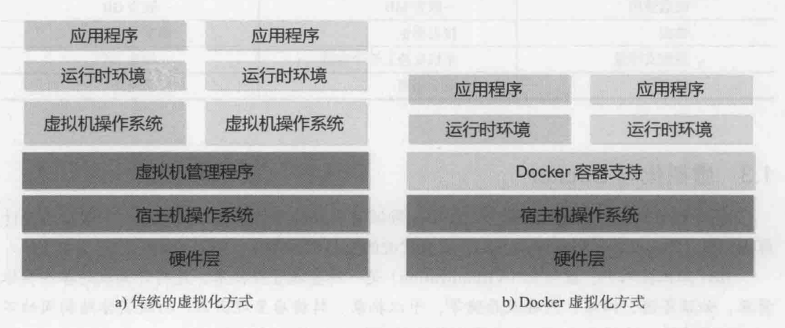

## 虚拟化与Docker

虚拟化在维基百科上的定义：
<font color=purple> 在计算机技术中，虚拟化是一种资源管理技术，是将计算机的各种实体资源，如服务器、网络、内存及存储等，予以抽象、转换后呈现出来，打破实体结构间的不可切割的障碍，使用户可以用比原本的组态更好的方式来应用这些资源。</font>

虚拟化技术的核心是对资源进行抽象，从大类上分，可分为基于硬件的虚拟化和基于软件的虚拟化。其中，真正意义上的基于硬件的虚拟化技术并不多见。
基于软件的虚拟化从对象所在的层次，又可以分为应用虚拟化和平台虚拟化（通常说的虚拟机技术即属于这个范畴）。

应用虚拟化：指的是一些模拟设备或Wine这样的软件。
平台虚拟化：可以细分为如下几个子类：

- <font color=red>完全虚拟化：虚拟机模拟完整的底层硬件环境和特权指令的执行过程，客户操作系统无需进行修改。例如VMware Workstation/VirtualBox/QEMU等</font>
- <font color=green>硬件辅助虚拟化：利用硬件（主要是CPU）辅助支持（目前x86体系结构上可用的硬件辅助虚拟化技术包括Intel-V和AMD-V）处理敏感指令来实现完全虚拟化的功能，客户操作系统无需修改，例如VMware Workstation/Xen/KVM</font>
- <font color=skyBlue>部分虚拟化：只针对部分硬件资源进行虚拟化，客户操作系统需要进行修改。现在有些虚拟化技术的早期版本仅支持部分虚拟化。</font>
- <font color=chartreuse> 超虚拟化：部分硬件接口以软件的形式提供给客户机操作系统，客户操作系统需要进行修改，例如早期的Xen</font> 
- <font color=blue>操作系统级虚拟化：内核通过创建多个虚拟的操作系统实例（内核和库）来隔离不同的进程。容器相关技术即在这个范畴。</font>
  Docker容器是在操作系统层面上实现虚拟化，直接复用本地主机的操作系统，因此更加轻量级。

### 在Windows上运行docker

Docker 实质上是在已经运行的 Linux 下制造了一个隔离的文件环境，因此它执行的效率几乎等同于所部署的 Linux 主机。
因此，Docker 必须部署在 Linux 内核的系统上。如果其他系统想部署 Docker 就必须安装一个虚拟 Linux 环境。
在 Windows 上部署 Docker 的方法都是先安装一个虚拟机，并在安装 Linux 系统的的虚拟机中运行 Docker。
Docker Desktop 是 Docker 在 Windows 10 和 macOS 操作系统上的官方安装方式，这个方法依然属于先在虚拟机中安装 Linux 然后再安装 Docker 的方法。

# 二、Docker的核心概念和安装

## Docker镜像

 Docker镜像类似于虚拟机镜像，可以将它理解为一个面向Docker引擎的只读模板，包含了文件系统。
 镜像是创建Docker容器的基础，通过版本管理和增量的文件系统，Docker提供了一套十分简单的机制来创建和更新现有的镜像，用户甚至可以直接从网上下载一个已经做好的应用镜像，并通过简单的命令就可以直接使用。

## Docker容器

 Docker容器类似于一个轻量级的沙箱，Docker利用容器来运行和隔离应用。
 容器是从镜像创建的应用运行实例，可以将其启动、开始、停止、删除，而这些容器都是相互隔离、互不可见的。
 镜像自身是只读的，容器从镜像启动时，Docker会在镜像的最上层创建一个可写层，镜像本身将保持不变。

## Docker仓库

 Docker仓库类似于代码仓库，是Docker集中存放镜像文件的场所。
 注册服务器是存放仓库的地方，其上往往存放这多个仓库，每个仓库集中存放某一类镜像，通过不同的标签来进行区分。
 例如存放Ubuntu操作系统镜像的仓库，称为Ubuntu仓库。

 当用户创建了自己的镜像之后可以使用push命令将它上传到指定的公有或者私有仓库。这样用户下次在另外一台机器上使用该镜像时，只需将其从仓库上pull下来就可以了。

# 三、镜像

## 获取镜像

使用docker pull命令从网络上下载镜像。格式为docker  pull  NAME[:TAG]
如果不指定TAG，则默认会选择latest标签，即下载仓库中最新版本的镜像。
镜像文件一般由若干层组成，下载过程中会获取输出镜像的各层信息。层其实是AUFS(高级联合文件系统)中的重要概念，是实现增量保存与更新的基础。

## 查看镜像信息

docker images 命令可以列出本地主机上已有的镜像

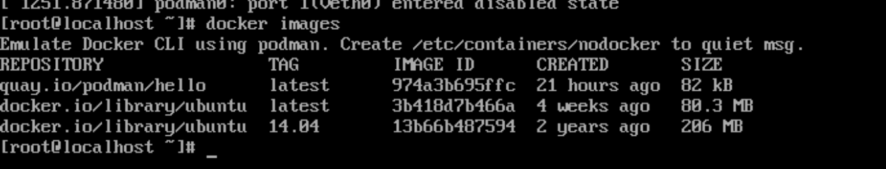

在列出信息中，可以看到几个字段信息：

- 来自于哪个仓库，比如ubuntu仓库

- 镜像的标签信息，比如14.04

- 镜像的ID号（唯一）

- 创建时间

- 镜像大小

使用docker  tag命令为本地镜像添加新的标签，通过镜像ID可以看出它们实际上是同一个镜像文件。

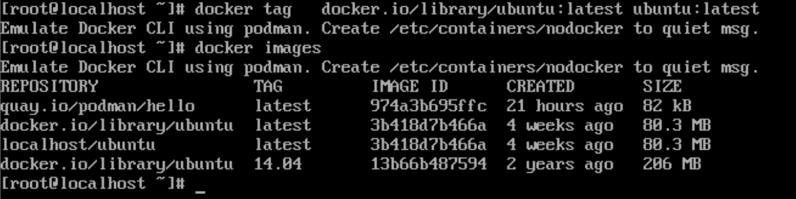

<font color=blue>使用docker inspect命令可以获取该镜像的详细信息</font>

## 搜寻镜像

docker search命令可以搜索远端仓库中共享的镜像，返回很多包含关键字的镜像，其中包括镜像名字，描述，星级（表示该镜像受欢迎程度），是否官方创建，是否自动创建等。

默认的输出结果将按照星级评价进行排序。

## 删除镜像

使用docker  rmi命令可以删除镜像，命令格式为docker  rmi  IMAGE[image ...]，其中IMAGE可以为标签或ID

当同一个镜像存在多个标签时，docker  rmi 命令只是删除了该镜像多个标签中的指定标签而已，并不影响镜像文件。

当镜像只剩下一个标签的时候就要注意了，此时再使用docker  rmi命令会彻底删除该镜像。

### 使用镜像ID删除镜像

使用docker rmi 命令后面跟上镜像的ID时，会先尝试删除所有指向该镜像的标签，然后删除该镜像文件本身。

当有该镜像创建的容器存在时，镜像文件默认时无法被删除的。

正确的做法是，先删除依赖该镜像的所有容器，再来删除镜像。

- sudo  docker  rm   容器ID
- sudo  docker   rmi  镜像ID

## 创建镜像

创建镜像的方法有三种：基于已有镜像的容器创建，基于本地模板导入，基于Dockerfile创建

### 基于已有镜像的容器创建

该方法主要是使用docker  commit 命令，其命令格式为docker  commit  [OPTIONS] CONTAINER  [REPOSITORY[:TAG]],主要选项包括：

- -a, --author="" 作者信息
- -m,  --message="" 提交消息
- -p,  --pause=true, 提交时暂停容器运行

使用如下命令创建新的镜像，docker  images中会有test镜像出现

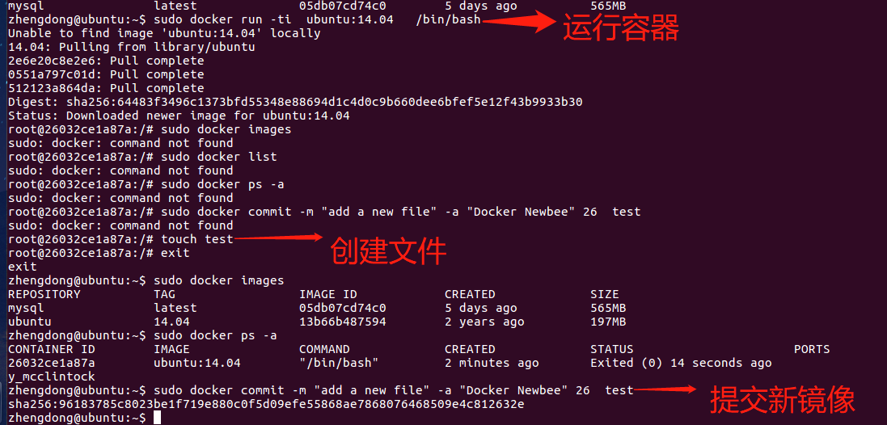

### 基于本地模板导入

从OPENVZ网站下载模板：https://download.openvz.org/template/precreated/

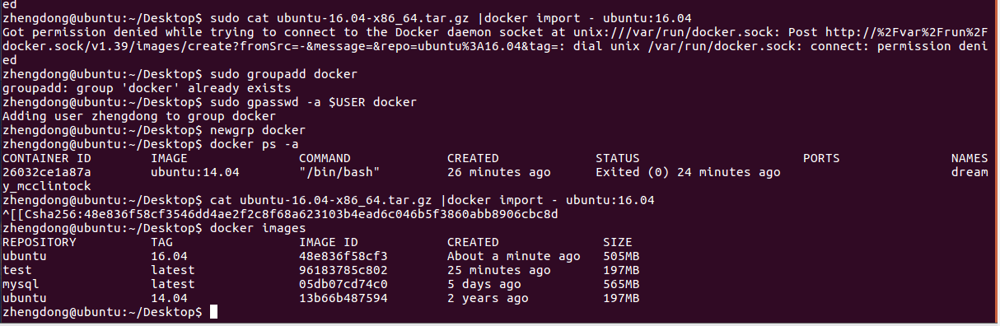

从OPENVZ网站上下载ubuntu 16.04模板

执行sudo cat ubuntu-16.04-x86_64.tar.gz |docker import - ubuntu:16.04报错：	

- sudo groupadd docker     #添加docker用户组
- sudo gpasswd -a $USER docker     #将登陆用户加入到docker用户组中
- newgrp docker     #更新用户组
- docker ps    #测试docker命令是否可以使用sudo正常使用

再执行cat ubuntu-16.04-x86_64.tar.gz |docker import - ubuntu:16.04不再报错

执行docker   images 后发现多了一个ubuntu 16.04的镜像

## 存储和载入镜像

可以使用docker  save 和 docker   load命令来存储和载入镜像

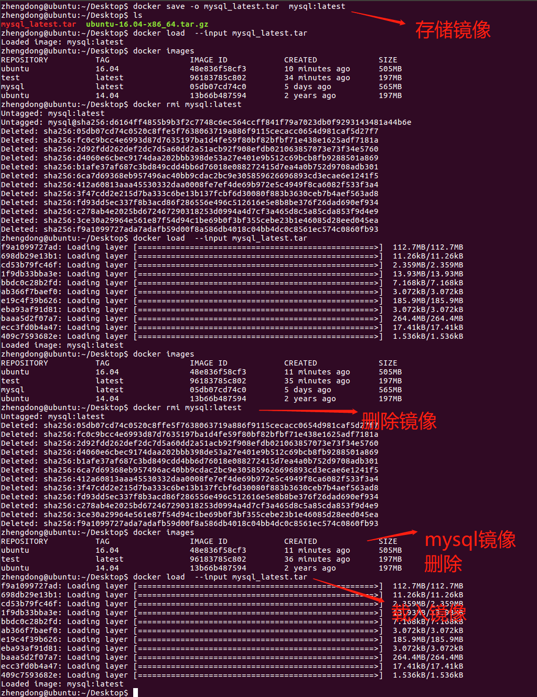

## 上传镜像

可以使用docker push命令上传镜像到仓库，默认上传到DockerHub官方仓库，命令格式为docker push  NAME[:TAG]

第一步：

centos7系统登录方式：

```dockerfile
docker   login
```

centos8及以上系统登录方式：

```dockerfile
podman login docker.io
```

<font  color=red>注意：podman login 和 podman login docker.io是不同的</font>


第二步：给镜像打标签

centos7  打标签方式

```dockerfile
docker tag 29bad2f8a84d zheng1dong2/new-repo:1.0
```

centos8及以上打标签方式

```dockerfile
podman tag  29bad2f8a84d  docker.io/zheng1dong2/new-repo:1.0
```

<font color=red>注意：29bad2f8a84d是镜像id,  zheng1dong2是dockerhub上注册的账号名称，new-repo是在dockerhub上创建的仓库名称，1.0是tag标签，这里podman 打标签需要加上docker.io</font>

否则可能出现如下问题：

```dockerfile
[root@localhost .ssh]# podman push zheng1dong2/new-repo:1.0
Getting image source signatures
Copying blob b362758f4793 [--------------------------------------] 8.0b / 190.9MiB
Copying blob 7b9106e4f33d [--------------------------------------] 8.0b / 2.0KiB
Copying blob 4849f19ea97e [--------------------------------------] 8.0b / 9.0KiB
Copying blob fb7792cec03a [--------------------------------------] 8.0b / 13.5KiB
Copying blob 9a044e4cd3a9 [--------------------------------------] 8.0b / 21.6MiB
Copying blob 50d50cf31f6c [--------------------------------------] 8.0b / 5.0KiB
Copying blob 6727c67c3a66 [--------------------------------------] 8.0b / 3.5KiB
Copying blob e29819798e50 [--------------------------------------] 8.0b / 5.5KiB
Copying blob 6339e3d757ac [--------------------------------------] 8.0b / 2.0KiB
Copying blob 194fcbcfcb81 [--------------------------------------] 8.0b / 787.8MiB
Copying blob 97148cd18852 [--------------------------------------] 8.0b / 2.5KiB
Error: Error copying image to the remote destination: Error writing blob: Error initiating layer upload to /v2/zheng1dong2/new-repo/blobs/uploads/ in registry-1.docker.io: errors:
denied: requested access to the resource is denied
unauthorized: authentication required

```

第三步：上传镜像到docker  hub

centos7 系统：

```dockerfile
docker push zheng1dong2/new-repo:1.0
```

centos8及以上系统：

```dockerfile
podman push docker.io/zheng1dong2/new-repo:1.0
```

打开hub.docker.com，进入自己的空间查看刚上传的镜像：


# 四、容器

## 创建容器

使用docker  create 命令新建一个容器

docker create 命令新建的容器处于停止状态，可以使用docker  start 命令启动。

启动容器有两种方式，一种是基于镜像新建一个容器并启动，另外一个是将在终止状态的容器重新启动。

docker run 等价于docker   create命令 加上  docker  start命令。

当利用docker  run来创建并启动容器时，Docker在后台运行的标准操作包括：

- 检查本地是否存在指定的镜像，不存在就从公有仓库下载（这一步基本能保证镜像是有的）
- 利用镜像创建并启动一个容器
- 分配一个文件系统，并在只读的镜像层外面挂载一层可读写层。
- 从宿主主机配置的网桥接口中桥接一个虚拟接口到容器中去。
- 从地址池配置一个IP地址给容器。
- 执行用户指定的应用程序。
- 执行完毕后容器被终止。

docker  run  -it    ubuntu:14.04   /bin/bash  能够启动一个bash终端，允许用户交互。

其中 -t 选项让Docker  分配一个伪终端并绑定到容器的标准输入上， -i  则让容器的标准输入保持打开。

### 守护态运行

docker run -d   ubuntu /bin/sh -c  "while true; do echo hello world; sleep 1; done"

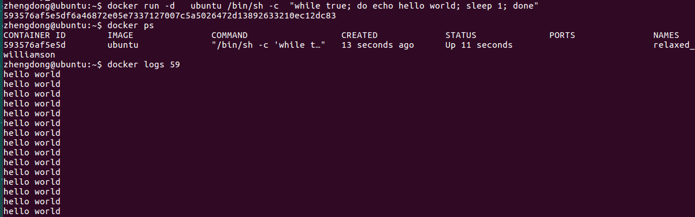

要获取容器的输出信息，可以通过docker   logs命令查看。

## 终止容器

可以使用docker  stop来终止一个运行中的容器， 命令的格式为 docker    stop  [-t | --time[=10]]

它首先会向容器发送SIGTERM信号，等待一段时间后默认为10秒，再发送SIGKILL信号终止容器。

- docker   ps  -a  -q：查看处于终止状态的容器的ID信息
- docker   start   容器ID：启动终止状态的容器
- docker   restart  容器ID：将一个运行态的容器终止，然后再重新启动它

## 进入容器

### attach命令

docker  attach 是Docker自带的命令

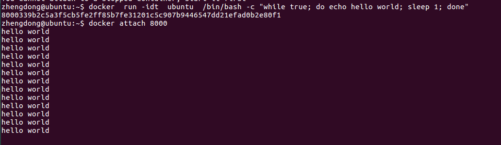

多个窗口同时attach到同一个容器时，所有窗口都会同步显示，当某个窗口因命令阻塞时，其他窗口也无法执行操作。

### exec命令

进入一个容器并启动一个bash:

docker   exec  -it    容器ID   /bin/bash

## 删除容器

docker   rm命令删除处于终止状态的容器，命令格式为docker   rm   [OPTIONS]  CONTAINER  [CONTAINER...]

支持的选项包括：

- -f,  --force = false 强行终止并删除一个运行中的容器
- -l ,  --link = false 删除容器的连接， 但保留容器
- -v, --volumes = false  删除容器挂载的数据卷

不建议使用-f，这样运行中的容器会突然中断

## 导入和导出容器

导出容器是指导出一个已经创建的容器到一个文件，不管此时这个容器是否处于运行态，可以使用docker  export命令，该命令格式为 docker   export   CONTAINER

```dockerfile
docker  export  -o  test_for_fun.tar   ce5
```

导入容器可以使用docker import  命令导入，成为镜像。

```dockerfile
docker  import   test_for_fun.tar test/ubuntu:v1.0
```

docker  save与docker   export的区别：

docker save用于导出镜像到文件，包含镜像元数据和历史信息；
docker export用于将当前容器状态导出至文件，类似快照，所以不包含元数据及历史信息，体积更小，此外从容器快照导入时也可以重新指定标签和元数据信息；

## 查看容器

### 查看容器详情

docker  container  inspect  test

会返回容器id, 创建时间，路径， 状态，镜像，配置等在内的各项信息

### 查看容器内进程

docker  top  容器ID

该命令会打印出容器内的进程信息，包括PID，用户，时间，命令等。

### 查看统计信息

docker  stats  容器ID

会显示CPU，内存，存储，网络等使用情况的统计信息

## 其他容器命令

### 复制文件

cp命令支持在容器和主机之间复制文件，命令格式为docker  cp  [OPTIONS]   container:SRC_PATH  DEST_PATH

支持的选项包括：

- -a ,  -archive: 打包模式，复制文件会带有原始的uid/gid信息
- -L，-follow-link:跟随软连接，当源路径为软连接时，默认只复制链接信息，使用该选项会复制链接的目标内容

例如，将本地的路径data复制到test容器(容器id,  d0f开头)的/tmp路径下

```dockerfile
docker  [container]  cp  data  d0f:/tmp/
```

### 查看变更

docker   [container]   diff    容器ID

### 查看端口映射

docker  container   port  容器id

### 更新配置

docker  container  update  容器id

例如，限制总配额为1秒，容器test(d0f)所占用时间为10%

```dockerfile
docker   update  [OPTIONS]  --cpu-quota   1000000   d0f
```

支持的选项包括：

□ -blkio-weigh uint16 ：更新块 IO 限制， 10~lOOO ，默认值为 0，代表着无限制；

□ -cpu-period   int：限制 CPU 调度器 CFS (Completely Fair Scheduler) 使用时间，

单位为微秒，最小 1000;

□ -cpu-quo int：限制 CPU 调度器 CFS 配额，单位为微秒，最小 1000;

□ -cpu-rt－ period int：限制 CPU 调度器的实时周期，单位为微秒；

□ -cpu-rt－ run ime int：限制 CPU 调度器的实时运行时，单位为微秒；

□ -c, -cpu-shares int：限制 CPU 使用份额；

□ -cpus decimal: 限制 CPU 个数；

□ -cpuset－cpus string: 允许使用的 CPU 核，如 0-3, 0,1; 

□ -cpuset－ mems string: 允许使用的内存块，如 0-3, 0,1; 

□ -kernel-memory bytes: 限制使用的内核内存；

□ -m, -memory bytes ：限制使用的内存；

□ -memory-reservation bytes: 内存软限制；

□ -memory-swap bytes ：内存加上缓存区的限制，－1 表示为对缓冲区无限制；

□ -restart string: 容器退出后的重启策略。

# 五、仓库

仓库是集中存放镜像的地方

仓库是一个具体的项目或目录，dl.dockerpool.com/ubuntu中，dl.dockerpool.com是注册服务器，ubuntu是仓库名。

仓库又分为公共仓库和私有仓库

## Docker Hub

### 登录

docker   login  命令来输入用户名，密码和邮箱来完成注册和登录

### 基本操作

docker  search  命令来查找官方仓库中的镜像，并利用docker  pull命令将它下载到本地

根据是否为官方提供，可以分为两类：

- 一种时类似于centos这样的镜像，也称为根镜像，这些镜像是由Docker公司创建，验证，支持和提供，往往使用单个单词作为名字
- 另一种比如ansible/centos7-ansible镜像，是由Docker用户ansible创建并维护的，带有用户名称为前缀，表明是某用户下的某仓库。

### 自动创建

自动创建是Docker  Hub提供的自动化服务，这一功能可以自动跟随项目代码的变更而重新构建镜像。

用户构建了某应用镜像，如果应用发布新版本，用户需要手动更新镜像，而自动创建则允许用户通过Docker Hub指定跟踪一个目标网站，比如说github，一旦项目发生新的提交，则自动执行构建。这样就完成了持续构建/持续交付（CI/CD）的操作。

## 第三方镜像市场

### 下载镜像

下载镜像也是使用 docker  pull命令，但是要在镜像名称前添加注册服务器的具体地址，

格式为index.tenxcloud.com/<namespace>/repository:<tag>

## 搭建本地私有仓库

### 使用registry镜像创建私有仓库

通过官方提供的registry镜像来简单搭建一套本地私有仓库环境：

```dockerfile
docker  run  -d  -p  5000:5000  registry:2
```

可以通过-v参数来将镜像文件存放在本地的指定路径

默认仓库被创建在容器的/var/lib/registry目录下，将上传的镜像放到/opt/data/registry目录，监听端口为5000：

```dockerfile
docker run -d  -p  5000:5000 -v  /opt/data/registry:/var/lib/registry  registry:2
```

### 

# 六、Docker数据管理

容器中管理数据的主要方式有两种：

- 数据卷：容器内数据直接映射到本地主机环境
- 数据卷容器：使用特定容器维护数据卷

## 数据卷

数据卷是一个可供容器使用的特殊目录，它将主机操作系统目录直接映射进容器，类似于Linux中的mount行为。

数据卷可以提供很多有用的特性：

- 数据卷可以在容器之间共享和重用，容器间传递数据将变得高效与方便
- 对数据卷内数据的修改会立马生效，无论是容器内操作还是本地操作
- 对数据卷的更新不会影响镜像，解耦开应用和数据
- 卷会一直存在，直到没有容器使用，可以安全地卸载它

### 创建数据卷

Docker提供了volume子命令来管理数据卷：

```dockerfile
docker   volume  create  -d   local  test1
```

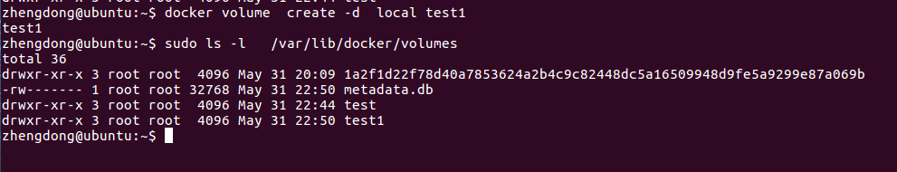

除了create命令外，docker  volume还支持inspect（查看详细信息），ls(列出已有数据卷)，prune (清理无用数据卷)， rm (删除数据卷)等

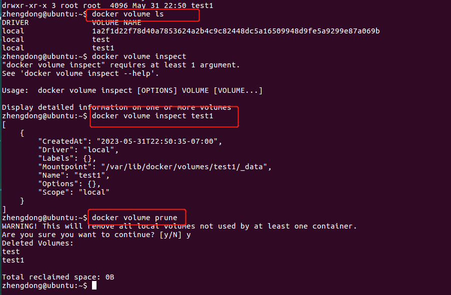

### 绑定数据卷

除了使用volume子命令来管理数据卷外，还可以在创建容器时将主机本地的任意路径挂载到容器内作为数据卷，这种形式创建的数据卷称为绑定数据卷。

docker   run 命令使用的时候，可以用 -mount选项来使用数据卷

-mount选项支持三种类型的数据卷

- volume: 普通数据卷， 映射到主机 /var/lib/docker/volumes 路径下
- bind :  绑定数据卷，映射到主机指定路径下
- tmpfs : 临时数据卷， 只存在于内存中

例如使用ubuntu:latest 镜像创建一个web容器，并创建一个数据卷挂载到容器的/opt/webapp目录：

```dockerfile
docker run -d -P  --name web  --mount  type=bind,source=/tmp,destination=/opt/webapp ubuntu:latest /bin/sh
```

这个命令等价于使用 -v标记

```dockerfile
docker run -d -P  --name web  -v  /tmp:/opt/webapp ubuntu:latest /bin/sh
```

这个功能在进行应用测试的时候十分方便，用户可以放置一些程序或者数据到本地目录中实时更新，然后在容器内运行和使用。

第一步：创建容器并挂载路径

```dockerfile
zhengdong@ubuntu:/$ docker run -d -P  --name web  --mount  type=bind,source=/tmp,destination=/opt/webapp ubuntu:latest /bin/sh -c "while true;do echo helloworld; sleep 2; done"
```

第二步：进入容器

```dockerfile
docker exec -it 762 /bin/sh
```

第三步：进入/opt/webapp中，创建文件并编辑

```Linux
> touch 1.txt
> echo zhengdong > 1.txt
```

第四步：退出容器，查看本地/tmp中是否有文件

```dockerfile
>  exit
>  zhengdong@ubuntu:/tmp$ ls
```

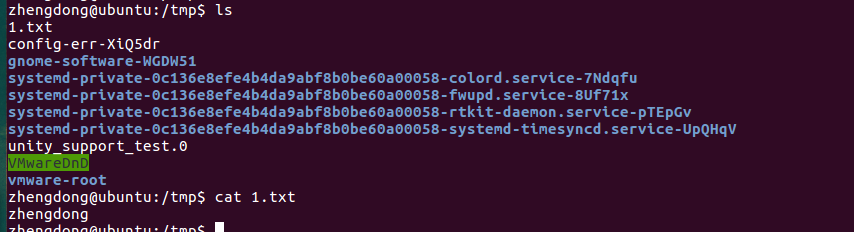

另外，本地目录的路径必须是绝对路径，容器内路径可以为相对路径，如果目录不存在，Docker会自动创建。

Docker挂载数据卷的默认权限是读写（rw）,用户也可以通过ro指定为只读：

```dockerfile
docker run -d -P  --name web  -v  /tmp:/opt/webapp:ro ubuntu:latest /bin/sh
```

ro：read  only，只读，加了之后，容器内对所挂载数据卷内的数据就无法修改了。

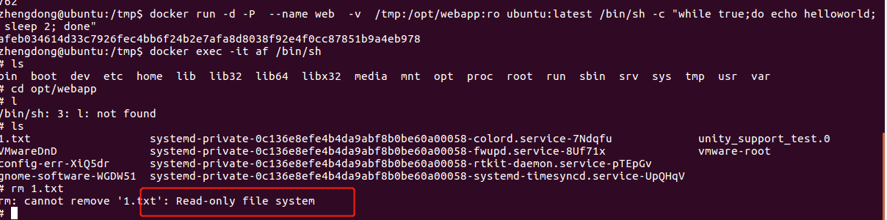

## 数据卷容器

如果用户需要多个容器之间共享一些持续更新的数据，最简单的方式是使用数据卷容器。数据卷容器也是一个容器，目的是专门提供数据卷给其他容器挂载。

创建数据卷容器：

```dockerfile
docker run -it -v /dbdata   --name  dbdata  ubuntu
```

创建容器并从dbdata容器挂载数据卷

```dockerfile
docker run -it --volumes-from  dbdata --name  db1  ubuntu
docker run -it --volumes-from  dbdata --name  db2  ubuntu
```

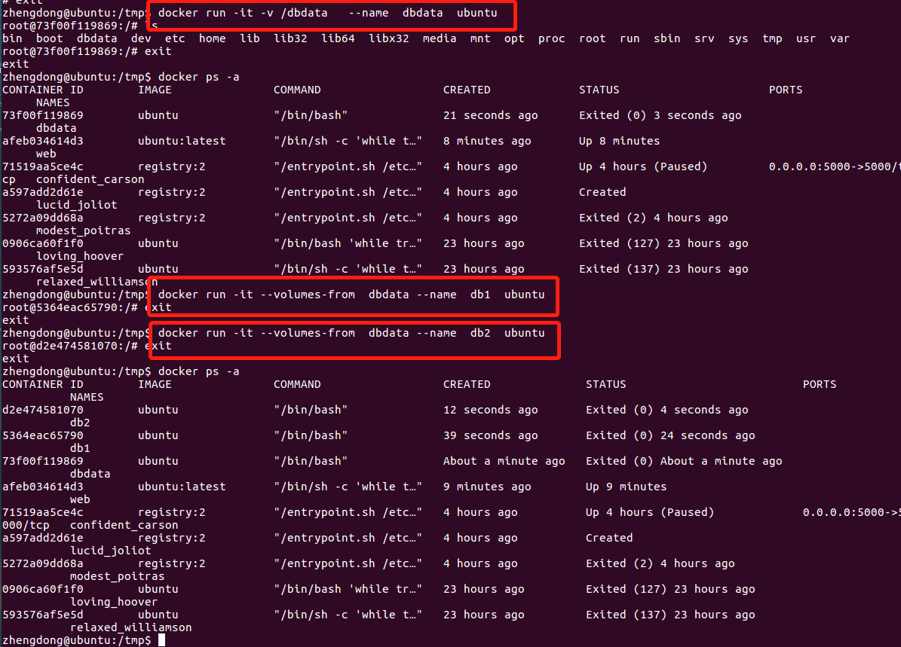

在其中一个容器中创建文件，其他容器中也会相应变化

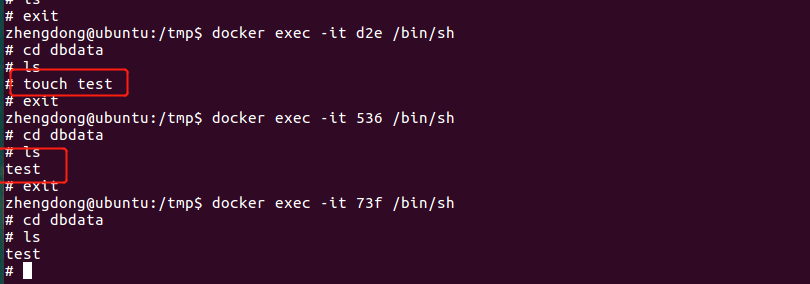

也可以从其他已经挂载了容器卷的容器来挂载数据卷

```dockerfile
docker run -itd --name db4  --volumes-from db2 ubuntu
```

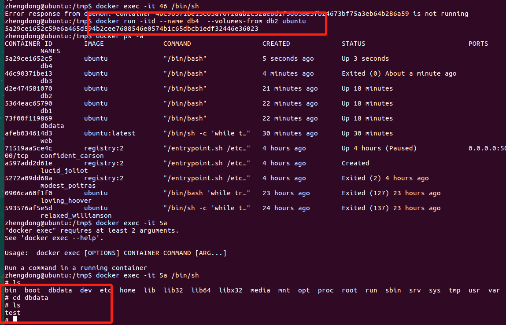

通过上面两节可以结合，既然容器和本地之间可以共享数据，而容器与容器之间也可以共享，那么两者结合一下，就可以通过本地变化触发数据卷容器的内容变化，继而触发挂载数据卷容器的容器内容发生变化。这样可以一次变化影响多个，不需要每个容器单独挂载本地文件。

## 利用数据卷容器来迁移数据

### 备份

docker  run  --volumes-from  dbdata  -v  ${pwd}:/backup   --name   worker   ubuntu   tar  cvf   /backup/backup.tar  /dbdata

--volumes-from   dbdata参数来让worker容器挂载dbdata容器的数据卷；

-v ${pwd}:/backup参数来挂载本地的当前目录到worker容器的/backup目录

worker容器启动后，使用tar  cvf   /backup/backup.tar  /dbdata命令将/dbdata下内容备份为容器内的/backup/backup.tar，即宿主机当前目录下的backup.tar

### 恢复

第一步：创建带有数据卷的容器dbdata2

docker    run   -v     /dbdata    --name   dbdata2   ubuntu    /bin/bash

第二步：创建一个新容器，挂载dbdata2的容器，并使用解压命令备份文件到所挂载的容器卷中

docker   run    --volumes-from   dbdata2   -v   ${pwd}:/backup   busybox    tar   xvf    /backup/backup.tar

假如数据文件比较重要，那么应该定期将主机的本地数据进行备份，或者使用支持容错的存储系统

假如数据文件不重要，不希望将数据保存在宿主机或者容器中，可以使用tmpfs类型的数据卷，数据只存储与内存中，容器退出后自动删除。


# 七、端口映射与容器互联

## 端口映射实现容器访问

### 从外部访问容器应用

当容器运行一些网络应用，要让外部访问这些应用时，可以通过-P或-p参数来指定端口映射。

当使用-P标记时，Docker会随机映射一个32768~49900的端口到内部容器开放的网络端口。

```dockerfile
docker run -P  docker.io/nginx
```

开启nginx应用，查看随机分配的端口

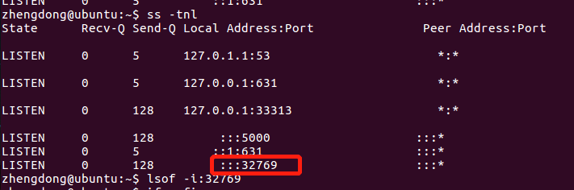

访问nginx，找到自己的ip地址，拼接上随机端口进行访问

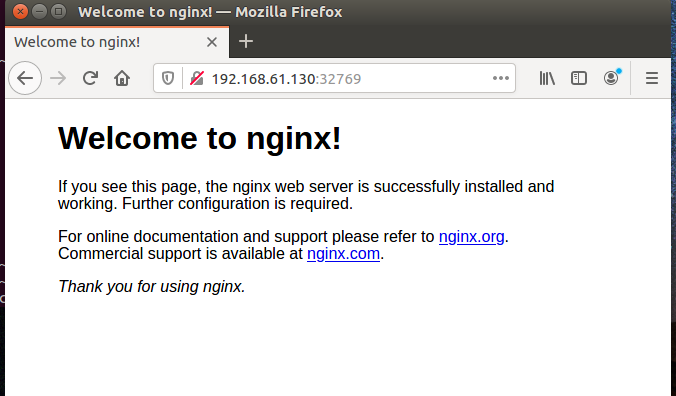

-p（小写的）可以指定要映射的端口，并且在一个指定的端口上只可以绑定一个容器。

### 映射所有的接口地址

```dockerfile
docker   run  -d  -p  5000:5000  ubuntu/test 
docker   run  -d  -p  5000:5000  -p  3000:80  ubuntu/test 
```

### 映射到指定地址的指定端口

```dockerfile
docker   run  -d  -p 127.0.0.1:5000:5000 ubuntu/test    
```

### 映射到指定地址的任意端口

```dockerfile
docker  run  -d  -p  127.0.0.1::5000 ubuntu/test  
```

还可以使用udp标记指定udp端口

```dockerfile
docker  run  -d  -p  127.0.0.1:5000:5000/udp ubuntu/test  
```

### 查看映射端口配置

```dockerfile
docker  port  relaxed_williamson  5000
```

## 互联机制实现便捷互访

### 自定义容器命名

容器的互联是一种让多个容器中的应用进行快速交互的方式，它会在源和接收容器之间创建连接关系，接收容器可以通过容器名快速访问到源容器，而不用指定具体的IP地址。

使用--name 标记可以为容器自定义命名：

```dockerfile
docker  run -d  -P  --name  web   training/webapp  python app.py
```

可以使用docker  [container]  inspect 来查看容器的名字：

```dockerfile
zhengdong@ubuntu:/tmp$ docker inspect -f "{{.Name}}"  afe
/web
```

### 容器互联

使用--link参数可以让容器之间安全地进行交互

创建一个新的数据库容器db：

```dockerfile
docker run  -d   --name  db   ubuntu:latest
```

创建一个web容器，并将它连接到db容器：

```dockerfile
docker run -d  -P  --name  web   --link db:db   ubuntu:latest 
```

--link参数的格式为--link  name:alias   其中name是要连接的容器的名称，alias是别名。

Docker相当于在两个互联的容器之间创建了一个虚机通道，不用映射它们的端口到宿主主机上。

Docker通过两种方式为容器公开连接信息：

- 更新环境变量
- 更新/etc/hosts文件

查看环境变量信息：

```dockerfile
root@8bf69e064818:/# env |grep DB_
DB_ENV_NGINX_VERSION=1.25.0
DB_ENV_NJS_VERSION=0.7.12
DB_PORT_80_TCP_ADDR=172.17.0.10
DB_PORT_80_TCP=tcp://172.17.0.10:80
DB_PORT=tcp://172.17.0.10:80
DB_PORT_80_TCP_PROTO=tcp
DB_PORT_80_TCP_PORT=80
DB_NAME=/dreamy_montalcini/db
DB_ENV_PKG_RELEASE=1~bullseye
```

进入web容器，查看/etc/hosts文件

```dockerfile
root@8bf69e064818:/# cat /etc/hosts
127.0.0.1	localhost
::1	localhost ip6-localhost ip6-loopback
fe00::0	ip6-localnet
ff00::0	ip6-mcastprefix
ff02::1	ip6-allnodes
ff02::2	ip6-allrouters
172.17.0.10	db fbe8dec539c7
172.17.0.12	8bf69e064818
```

可以看到db容器的IP和主机名,分别为172.17.0.10     db

web容器中安装ping命令，测试跟db容器的联通

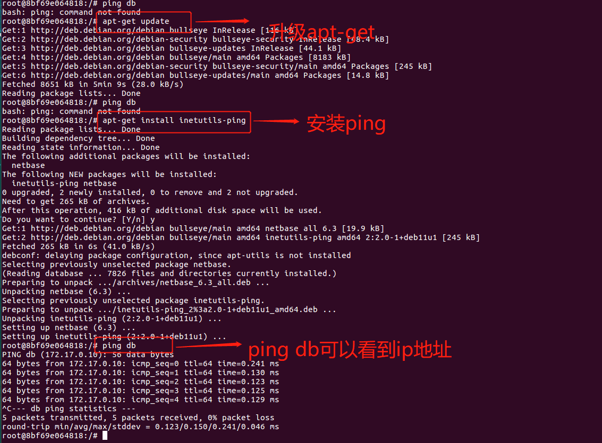

可以看出，ping db确实解析成172.17.0.10这个地址。

# 八、使用Dockerfile创建镜像

## 基本结构

Dockerfile主体内容分为四部分：基础镜像信息、维护者信息、镜像操作指令和容器启动时执行指令。

首行可以通过注释来指定解析器命令，后续通过注释说明镜像的相关信息。主体部分首先使用FROM指令指明所基于的镜像名称，接下来一般是使用LABEL指令说明维护者信息。后面则是镜像操作指令，例如RUN指令将对镜像执行跟随的命令。

每运行一条RUN指令，镜像添加新的一层，并提交。最后是CMD指令，来指定运行容器时的操作命令。

```dockerfile
# escape=\ (backslash) 
# This dockerfile uses the ubuntu:xeniel image 
# VERSION 2 - EDITION 1 
# Author: docker_user 
# Command format: Instruction [arguments / command] 
# Base image to use, this must be set as the first line 
FROM ubuntu:xeniel 

# Maintainer: docker_user <docker_user at email.com> (@docker_user) 
LABEL maintainer docker_user<docker_user@email.com> 

# Commands to update the image 
RUN echo "deb http://archive.ubuntu.com/ubuntu/ xeniel main universe" >> /etc/apt/sources.list
RUN apt-get update && apt-get install -y nginx 
RUN echo "\ndaemon off;">> /etc/nginx/nginx.conf
# Commands when creating a new container
CMD /usr/sbin/nginx
```

## 指令说明

| 分类     | 指令        | 说明                               |
| -------- | ----------- | ---------------------------------- |
|          | ARG         | 定义创建镜像过程中使用的变橇       |
|          | FROM        | 指定所创建镜像的基础镜像           |
|          | LABEL       | 为生成的镜像添加元数据标签信息     |
|          | EXPOSE      | 声明镜像内服务监听的端口           |
|          | ENV         | 指定环境变量                       |
|          | ENTRYPOINT  | 指定镜像的默认入口命令             |
| 配置指令 | VOLUME      | 创建一个数据卷挂载点               |
|          | USER        | 指定运行容器时的用户名或 UID       |
|          | WORKDIR     | 配置工作目录                       |
|          | ONBUILD     | 创建子镜像时指定自动执行的操作指令 |
|          | STOPSIGNAL  | 指定退出的信号值                   |
|          | HEALTHCHECK | 配置所启动容器如何进行健康检查     |
|          | SHELL       | 指定默认shell类型                  |

| 分类     | 指令 | 说明                         |
| -------- | ---- | ---------------------------- |
|          | RUN  | 运行指定命令                 |
|          | CMD  | 启动容器时指定默认执行的命令 |
| 操作指令 | ADD  | 添加内容到镜像               |
|          | COPY | 复制内容到镜像               |

### 配置指令

- ARG

定义创建镜像过程中使用的变量。

格式为ARG  <name>   [=<default value>]

Docker内置了一些镜像创建变量，用户可以直接使用而无需声明，包括HTTP_PROXY, HTTPS_PROXY ,  FTP_PROXY , NO_PROXY

- FROM

指定所创建镜像的基础镜像

格式为FFROM <image> [AS <name> ］或 FROM <image>:<tag> [AS <name>] 

FROM <image>@<digest> [AS <name>]

任何Dockerfile中第一条指令必须为FROM指令。并且，如果在同一个Dockerfile中创建多个镜像时，可以使用多个FROM指令（每个镜像一次）

ARG VERSION=9.3 

FROM debian:${VERSION} 

- LABEL

LABEL指令可以为生成的镜像添加元数据标签信息。这些信息可以用来辅助过滤出特定镜像。

相当于给镜像打上标记，可以通过这个标记进行过滤识别

格式为LABEL  <KEY>=<VALUE>   <KEY>=<VALUE>    <KEY>=<VALUE>  ...

例如：

LABEL    version  ="1.0.0-rc3"

- EXPOSE

声明镜像内服务监听的端口。

格式为EXPOSE  <port>  [<port>/<protocol>...]

例如：  EXPOSE     22    80     8443

该指令只是起到声明作用，并不会自动完成端口映射。

如果要映射端口出来，在启动容器时可以使用-P参数（Docker主机会自动分配一个宿主机的临时端口）或-p  HOST_PORT:CONTAINER_PORT(具体指定所映射的本地端口)

- ENV

指定环境变量，在镜像生成过程中会被后续RUN指令使用，在镜像启动的容器中也会存在。

格式为ENV  <key>  <value> 或者 ENV  <key>=<value>...

例如：

ENV  APP_VERSION = 1.0.0

指令指定的环境变量在运行时可以被覆盖掉，如 docker   run  --env   <key>=<value>  built_image

- ENTRYPOINT

指定镜像的默认入口命令，该入口命令会在启动容器时作为根命令执行，所有传入值作为该命令的参数。

支持两种格式：

1. ENTRYPOINT   ["executable","param1","param2"]: exec调用执行
2. ENTRYPOINT   command   param1   param2:  shell   中执行。

此时，CMD指令指定值将作为根命令的参数。

每个Dockerfile中只能有一个ENTRYPOINT，当指定多个时，只有最后一个生效。

在运行时，可以被--entrypoint参数覆盖掉，如 docker  run --entrypoint.

- VOLUME

创建一个数据卷挂载点

格式为VOLUME  ["/data"]

运行容器时可以从本地主机或者其他容器挂载数据卷，一般用来存放数据库和需要保持的数据等。

- USER

指定运行容器时的用户名或UID，后续的RUN等指令也会使用指定的用户身份。

格式为 USER  daemon

当服务不需要管理员权限时，可以通过该命令指定运行用户，并且可以在Dockerfile中创建所需要的用户。

RUN   groupadd -r  postgres  &&  useradd  --no-log-init  -r -g  postgres  postgres

要临时获取管理员权限可以使用 gosu  命令。

- WORKDIR

为后续的RUN/CMD/ENTRYPOINT 指令配置工作目录

格式为 WORKDIR  /  path /  to  / workdir

可以使用多个WORKDIR指令，后续命令如果参数是相对路径，则会基于之前命令指定的路径。

例如：WORKDIR   /a  ;  WORKDIR   b ;  WORKDIR   c;  RUN  pwd

最终路径为 /a/b/c

可以看出WORKDIR类似于cd，推荐WORKDIR指令中只使用绝对路径，避免出错。

- ONBUILD

指定当基于所生成镜像创建子镜像时，自动执行的操作指令。

格式为ONBUILD  [INSTRUCTION]

这个就类似于JAVA中的super操作进行子类初始化，会先去调用父类的初始化

父镜像中指定ONBUILD指令，在创建子镜像时会先执行父镜像中配置的ONBUILD指令。

由于ONBUILD指令是隐式执行的，推荐在使用它的镜像标签中进行标注，例如：ruby:2.1-onbuild

ONBUILD指令在创建专门用于自动编译/检查等操作的基础镜像时，十分有用。

- STOPSIGNAL

指定所创建镜像启动的容器接收退出的信号值：

STOPSIGNAL  signal

- HEALTHCHECK

配置所启动容器如何进行健康检查（如何判断健康与否）

格式有两种：

1. HEALTHCHECK  [OPTIONS]  CMD  command: 根据所执行命令返回值是否为0来判断
2. HEALTHCHECK   NONE:禁止基础镜像中的健康检查。

OPTIONS支持如下参数：

1）- interval=DURATION (default = 30s) : 过多久检查一次

2） - timeout = DURATION (default = 30s): 每次检查等待结果的超时

3）- retries = N (default = 3) ：如果失败了，重试几次才最终确定失败

- SHELL

指定其他命令使用shell 时的默认shell类型：

SHELL ["executable","parameters"]

默认值为["/bin/sh","-c"]

<font color=red>对于Windows系统，Shell路径使用了“\”作为分隔符，建议在Dockerfile开头添加# escape='来指定转义符‘</font>

### 操作指令

- RUN 

运行指定命令

格式为RUN   <command>  或者 RUN  ["executable","param1","param2"]

后者指令会被解析成JSON数组，因此必须用双引号。前者默认将在shell终端中运行命令，即/bash/sh -c;

后者使用exec 执行，不会启动shell环境。

指定使用其他终端类型可以通过第二种方式实现，例如RUN   ["/bin/bash", "-c", "echo hello"]

每条RUN指令将在当前镜像基础上执行指定指令，并提交为新的镜像层。

- CMD

CMD指令用来指定启动容器时默认执行的命令。

支持三种格式：

1. CMD  ["executable","param1","param2"]：相当于执行executable  param1  param2, 推荐方式；
2. CMD   command   param1   param2:在默认的shell中执行，提供给需要交互的应用
3. CMD   ["param1","param2"]: 提供给ENTRYPOINT 的默认参数

每个Dockerfile只能有一条CMD命令，如果指定了多条命令，只有最后一条会被执行

如果用户启动容器时手动指定了运行的命令（作为run命令的参数），则会覆盖CMD指定的命令。

docker   run   -d    ubuntu:latest   -c  "while true; do  echo  hello wold; sleep 1; done"

- ADD

添加内容到镜像

格式为ADD <src>  <dest>

该命令将复制指定的<src> 路径下内容到容器中的<dest>路径下

其中src可以是Dockerfile所在目录的一个相对路径；也可以是一个URL，还可以是一个tar文件

dest可以是镜像内绝对路径，或者相对于工作目录（WORKDIR）的相对路径。

路径支持正则表达式，例如：

ADD  *.c    /code/

- COPY

复制内容到镜像

格式为COPY  <src>   <dest>

复制本地主机<src>  下的内容到镜像的<dest>,目标路径不存在的话，会自动创建

路径同样支持正则表达式

COPY  与  ADD指令功能类似，当使用本地目录为源目录时，推荐使用COPY


## 创建镜像

编写完Dockerfile之后，可以通过docker  build  命令来创建镜像

基本的格式为docker  build   [OPTIONS] PATH | URL |  -

该命令将读取指定路径下（包括子目录）的Dockerfile，并将该路径下所有数据作为上下文发送给Docker服务端。

Docker服务端在校验Dockerfile格式通过后，逐条执行其中定义的指令，碰到ADD /COPY/ RUN指令会生成一层新的镜像。最终如果创建镜像成功，会返回最终镜像的ID。

要指定生成镜像的标签信息，可以通过-t选项，该选项可以重复使用多次为镜像一次添加多个名称。

例如：上下文路径为/tmp/docker_builder/ ,并且希望生成镜像标签为builder/first_image:1.0.0, 可以使用如下命令：

```dockerfile
docker   build  -t   builder/first_image:1.0.0  /tmp/docker_builder/
```

### 选择父镜像

用户可以选择两种镜像作为父镜像，一种是所谓的基础镜像，另外一种是普通的镜像。

基础镜像比较特殊，其dockerfile中往往不存在FROM指令，或者基于scratch镜像，这意味着其在整个镜像树中处于根的位置。 

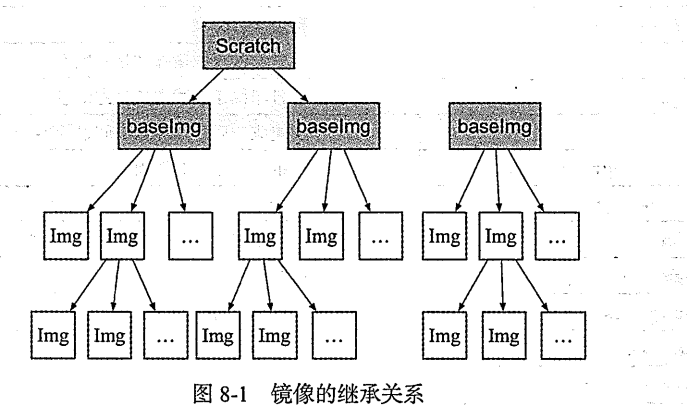

### 使用.dockerignore文件

这个文件类似于.gitignore，让Docker忽略匹配路径或文件，在创建镜像时候不将无关数据发送到服务端。

.dockerignore文件中模式语法支持正则表达式匹配：

- “*” 表示任意多个字符
- “？”表示单个字符
- “！”表示不匹配，即不忽略指定的路径或文件

### 多步骤创建

创建main.go文件

```go
//main.go will output "Hello,Docker"
package main
import (
        "fmt"
)

func main() {
        fmt.Println("Hello,Docker")
}
```

接着创建Dockerfile，使用golang:1.9镜像编译应用二进制文件为app,使用精简的镜像alpine:latest 作为运行环境。

```dockerfile
# 第一阶段：golang:1.9作为编译器
FROM  golang:1.9 as builder
# 创建文件夹
RUN  mkdir  -p  /go/src/test
# 进入文件夹
WORKDIR  /go/src/test
# 拷贝main.go文件到/go/src/test
COPY  main.go  .
# 运行 CGO_ENABLED用于交叉编译，此处禁用
# 当CGO_ENABLED=1， 进行编译时， 会将文件中引用libc的库（比如常用的net包），以动态链接的方式生成目标文件。
# 当CGO_ENABLED=0， 进行编译时， 则会把在目标文件中未定义的符号（外部函数）一起链接到可执行文件中。
# GOOS：目标平台的操作系统(darwin、freebsd、linux、windows)
# 编译到当前文件夹下，输出为app
RUN   CGO_ENABLED=0  GOOS=linux go build -o app .

# 第二阶段：使用alpine linux作为运行环境
FROM  alpine:latest
# 我们在构建 docker 镜像时一般使用的是 alpine linux 系统，默认是不带 ca-certificates 根证书的，导致无法识别外部 https 携带的数字证书，执行此命令可以识别来自外部https的数字证书
RUN  apk --no-cache  add  ca-certificates
WORKDIR  /root
# 将从 from 指定的构建阶段中寻找源文件
COPY   --from=builder   /go/src/test/app  .
# 运行app
CMD  ["./app"]
```

当前dockerfile所在文件夹的内容很多，导致上下文中的很多无用数据都上传了，其实应该找一个干净的文件夹再执行build操作。

执行docker build命令，-t表示指定生成的tag标签：

```dockerfile
docker build -t  yeasy/test-multistage:latest .
```

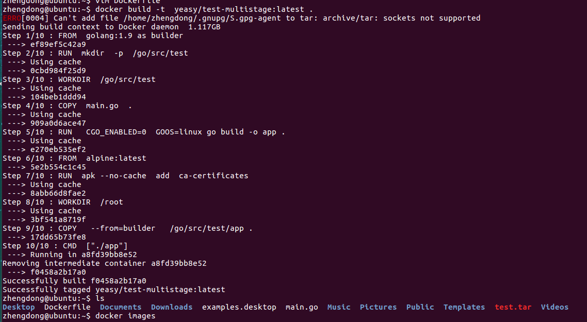

最后运行构建出的镜像,执行main.go的效果如下：

```dockerfile
zhengdong@ubuntu:~$ docker run --rm yeasy/test-multistage:latest
Hello,Docker
```

## 最佳实践

总结实践经验，完善所生成的镜像：

- 精简镜像用途：尽量让每个镜像的用途都比较集中单一，避免构造大而复杂、多功能的镜像
- 选用合适的基础镜像：容器的核心是应用。选择过大的父镜像（如Ubuntu系统镜像），会造成最终生成应用镜像的臃肿，推荐选用瘦身过的应用镜像（如：node:slim),或者较为小巧的系统镜像（如alpine/busybox/debian),上例中我们就使用的是alpine linux，最后生成的镜像大小只有9.5m左右
- 提供注释和维护者信息：Dockerfile也是一种代码，需要考虑方便后续的扩展和他人的使用
- 正确使用版本号：使用明确的版本号信息，如1.0，2.0，而非依赖于默认的latest,通过版本号可以避免环境不一致导致的问题（如golang:1.9）
- 减少镜像层数：如果希望所生成镜像层数尽量少，则要尽量合并 RUN、 ADD、 COPY 指令。通常情况下，多个 RUN 指令可以合并为一条 RUN 指令；

- 恰当使用多步骤创建 (17.05 ＋版本支持）：通过多步骤创建，可以将编译和运行等过程分开，保证最终生成的镜像只包括运行应用所需要的最小化环境。当然，用户也可以通过分别构造编译镜像和运行镜像来达到类似的结果，但这种方式需要维护多个Dockerfile

- 使用.dockerignore文件：使用它可以标记在执行docker  build时忽略的路径和文件，避免发送不必要的数据内容，从而加快整个镜像创建过程。

  在加入.dockerignore文件之前，需要上传1.0g文件

  加入.dockerignore文件之后，只需要上传80m文件，只需要编写.dockerignore文件并将其放在上下文路径中即可。

- 及时删除临时文件和缓存文件：特别是在执行apt-get指令后，/var/cache/apt下面会缓存了一些安装包

- 提高生成速度：如合理使用cache，减少内容目录下的文件，或使用.dockerignore文件指定等

- 调整合理的指令顺序：在开启cache的情况下，内容不变的指令尽量放在前面，这样可以尽量复用

- 减少外部源的干扰：如果确实需要从外部引入数据，需要指定持久的地址，并带版本信息等，让他人可以复用而不出错。也就是说引入的外部数据需要稳定持久不变，这样执行的时候才没问题。


