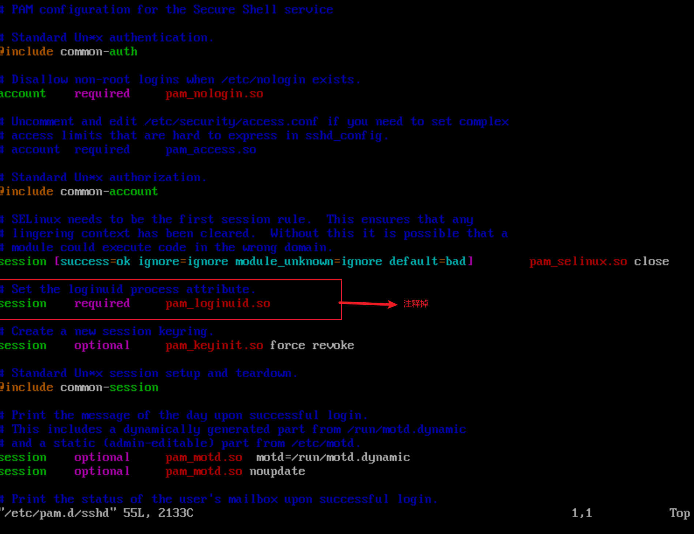

# 九、操作系统

## BusyBox

BusyBox是一个集成了一百多个最常用Linux命令的精简工具箱，它只有不到2MB大小，被誉为“Linux系统的瑞士军刀”。

## Alpine

Alpine操作系统是一个面向安全的轻型Linux发行版，关注安全，性能和资源效能。不同与其他发行版，Alpine采用了mus1 libc和BusyBox以减小系统的体积和运行时资源消耗，比BusyBox功能上更加完善。

在保持瘦身的同时，Alpine还提供了包管理工具apk查询和安装软件包。


如果使用Alpine镜像，安装软件包时可以使用apk工具，例如：

```dockerfile
apk   add   --no-cache   <package>
```

## Debian/Ubuntu

Debian和Ubuntu都是目前较为流行的Debian系的服务器操作系统，十分适合研发场景。

Debian是基于GPL授权的开源操作系统，是目前个人电脑与服务器中最受欢迎的开源操作系统之一。

Ubuntu是以桌面应用为主的GNU/Linux开源操作系统，

## Centos/Fedora

CentOS和Fedora都基于Redhat的Linux发行版。CentOS是目前企业级服务器的常用操作系统，Fedora则主要面向个人桌面用户。

CentOS(Community Enterprise Operating System, 社区企业操作系统) 基于Red  Hat  Enterprise Linux源代码编译而成。由于CentOS与RedHat Linux源于相同的代码基础，所以很多成本敏感且需要高稳定性的公司就使用CentOS来替代商业版Red Hat Enterprise Linux。CentOS自身不包含闭源软件。

Fedora是由Fedora  Project 社区开发，Red  Hat公司赞助的Linux发行版。它的目标是创建一套新颖、多功能并且自由和开源的操作系统。

# 十、为镜像添加SSH服务

## 基于commit命令创建

### 准备工作

准备工作：拉取ubuntu镜像，并启动容器，使用apt-get  update更新软件源信息


### 安装和配置SSH服务

apt-get  install   openssh-server

创建/var/run/sshd目录，并启动SSH服务，使用netstat -tunlp命令查看22端口，可见此端口已经处于监听状态：


修改SSH服务的安全登录配置，取消pam登录限制：

```shell
sed -ri 's/session  required  pam_loginuid.so/#session required pam_loginuid.so/g'  /etc/pam.d/sshd
```

或者安装vim（apt-get install  vim），自行编辑/etc/pam.d/sshd，注释掉**session required pam_loginuid.so**



使用ssh-keygen -t rsa命令生成公钥信息。


创建自动启动ssh服务的可执行文件run.sh,并添加可执行权限：

```shell
vi  /run.sh
chmod +x  /run.sh
```

run.sh的内容为：

```shell
#!/bin/bash
/usr/sbin/sshd -D
```

### 保存镜像

退出容器，并将该容器用docker commit命令保存为一个新的sshd:ubuntu镜像


### 使用镜像

启动容器，并添加端口映射10022 --> 22， 其中10022是宿主机的端口，22是容器的SSH服务监听端口。

docker  run  -p  10022:22  -d  sshd:ubuntu  /run.sh


在宿主主机上可以通过SSH访问10022端口来登录容器：

```dockerfile
ssh  192.168.140.128 -p  10022
```

