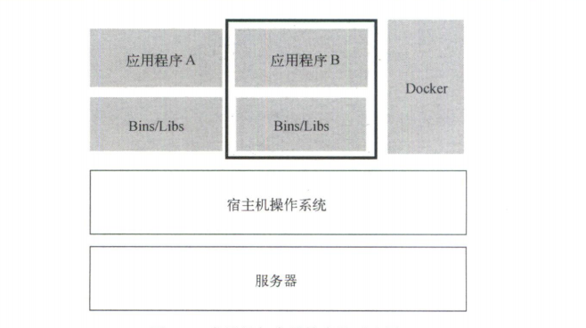
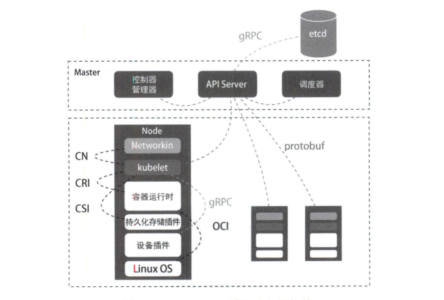
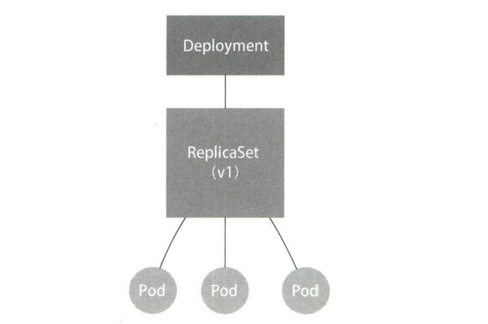
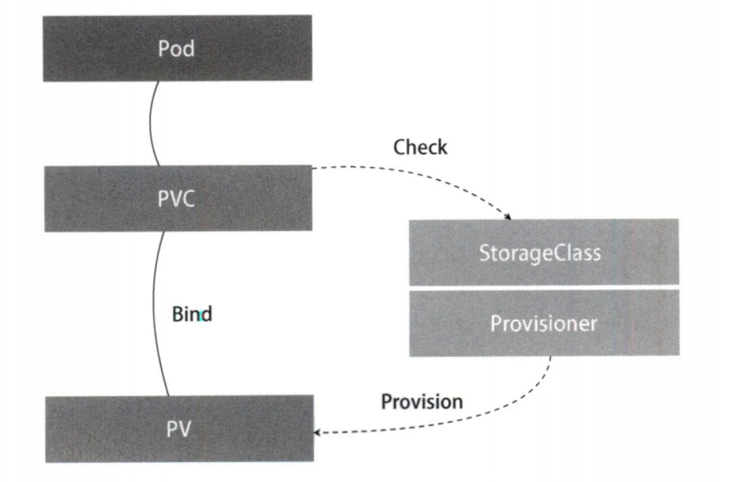
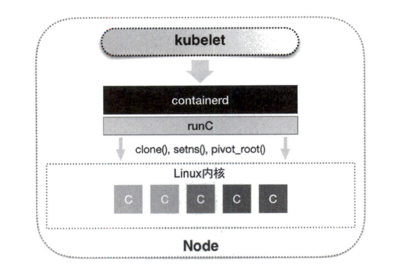
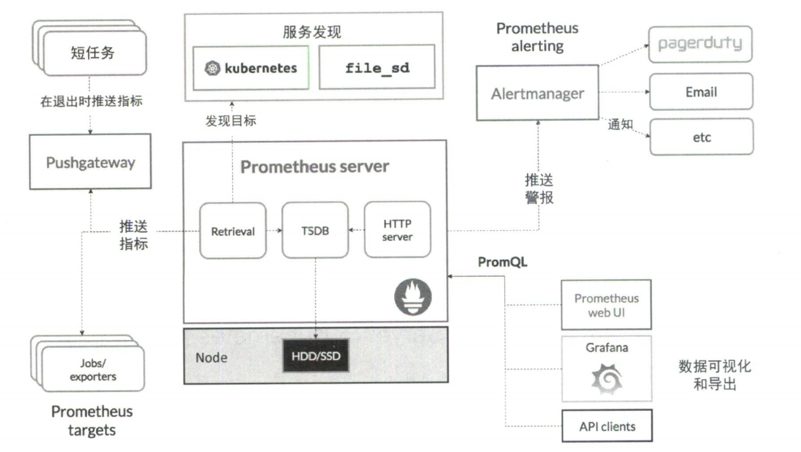
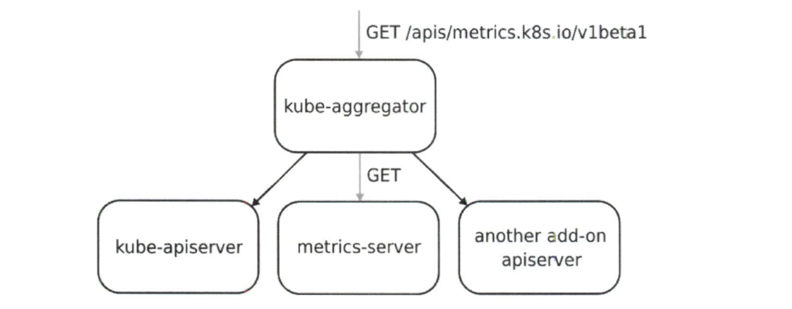

# 深入剖析Kubernetes

## 云原生大事记

Docker项目给PaaS世界带来的降维打击，其实是它提供了—种非常便利的打包机制。这种机制直接打包了应用程序运行所需要的整个操作系统，从而保证了本地环境和云端环境的高度—致，避免了用户通过‘试错,’来匹配不同运行环境之间差异的痛苦过程。

Docker项目之所以能获得如此高的关注度，一方面是因为它解决了应用打包和发布这一困扰运维人员多年的技术难题；另一方面是因为它第一次把一个纯后端的技术概念，通过非常友好的设计和封装，交到了最广大的开发者群体手里。

Docker项目从发布之初到全面发力，从技术、社区、市场全方位争取到的开发者群体，实际上都是为此后将整个生态吸引到自家PaaS上的一个铺垫。PaaS的定义变成了一套以Docker容器为技术核心，以Docker镜像为打包标准的全新“容器化”思路。

Docker项目在短时间内迅速崛起的3个重要原因：

- Docker镜像通过技术手段解决了PaaS的根本性问题
- Docker容器同开发者之间有着与生俱来的密切关系
- PaaS概念已经深入人心的完美契机

# 容器技术基础

## 从进程开始说起

容器本身的价值非常有限，真正有价值的是容器编排。

操作系统从程序中发现输入数据保存在一个文件中，然后这些数据会被加载到内存中待命。同时，操作系统又读取到了计算加法的指令，这时它就需要指示CPU完成加法操作。而CPU与内存协作进行加法计算，又会使用寄存器存放数值，内存堆栈保存执行的命令和变量。

容器技术的核心功能就是通过约束和修改进程的动态表现，为其创造一个“边界”。

<font color=red>对于Docker等大多数Linux容器来说，Cgroups技术是用来制造约束的主要手段，而Namespace技术是用来修改进程视图的主要方法。</font>

**Namespace的具体解释**

Docker针对运行在容器中运行的程序会重新计算PID，比如PID=1,实际上，在宿主机的操作系统中，它的进程号是另外一个数字，比如PID=100。

在Linux系统中创建线程的系统调用是

```shell
int pid＝clone(main_function, stack_size, CLONE_NEWPID|SIGHLD, NULL)
```

这样新创建的进程会看到一个全新的进程空间，在这个进程空间中，它的PID是1。

多次调用这个clone方法，会创建多个PID Namespace，每个Namespace中应用进程都会认为自己是当前容器里的第1号进程，既看不到宿主机的真正的进程空间，也看不到其他PID Namespace里的具体情况。

<font color=blue>Linux操作系统中还提供了Mount/UTS/IPC/Network和User这些Namespace,用来对各种进程上下文施障眼法，比如Mount Namespace用于让被隔离进程只能看到Namespace里的挂载点信息。</font>

<font color=darkred>容器其实是一种特殊的进程而已</font>。

在使用Docker时，并没有一个真正的Docker容器在宿主机中运行，Docker项目帮助用户启动的还是原来的应用进程，只不过在创建这些进程时，Docker为它们加上了各种各样的Namespace参数。

这些进程只是由于通过Cgroups技术来实现了相互隔离，并通过Namespace技术来修改了应用进程看待整个计算机“视图”的视野，仿佛置身于容器中，这些只不过是障眼法罢了。

## 隔离与限制

用户在容器里运行的应用进程，跟宿主机上的其他进程一样，都由宿主机操作系统统一管理，只不过这些被隔离的进程拥有额外设置的Namespace参数。而Docker项目在这里扮演的角色，更多的是旁路式的辅助和管理工作。



**容器化比虚拟化的优点**

虚拟化技术：虚拟机自身占用100-200M内存，另外调用宿主机操作系统需要进行拦截和处理，对计算资源、网络和磁盘I/O的损耗非常大。

容器化技术：不需要额外的操作系统，使用宿主机自身的操作系统，另外调用不会被拦截。

敏捷和高性能是容器相较于虚拟机的最大优势，也是它能够在PaaS这种更细粒度的资源管理平台上大行其道的重要原因。

**容器化比虚拟化的缺点**

1. 容器化相较于虚拟化的缺点在于隔离得不彻底。多个容器之间共享宿主机的操作系统内核。虽然容器中可以挂载其他操作系统，不过归根结底还是共享了宿主机的内核。<font color=red>所以，容器内的操作系统是依赖于宿主机的操作系统的，由此看Windows宿主机上运行Linux容器，或者在低版本的Linux宿主机上运行高版本的Linux容器是行不通的。</font>

2. Linux内核中很多资源和对象是不能够被Namespace化的，比如说时间。比如说在容器中修改了时间，那么整个宿主机操作系统的时间也会被修改，这显然是不行的，这种情况下，容器中就存在一些不能做的事情，降低了自由度。
3. 容器向应用暴露的攻击面是相当大的，应用“越狱”的难度自然也比虚拟机低得多

Namespace只是让进程假装看不见其他的进程，但是实际上其他进程会把他的资源占用，或者他占用其他进程的资源，并没有做到真正一样的隔离。

Linux Cgroups就可以达到这种真正意义上的隔离，限制一个进程组能够使用的资源上限，包括CPU、内存、磁盘、网络带宽等。

一个正在运行的Docker容器其实就是一个启用了多个Linux Namespace的应用进程，而这个进程能够使用的资源量受Cgroups配置的限制。

在容器中使用top命令，显示的信息是宿主机的CPU和内存数据，而非当前容器的数据。/proc文件系统并不知道用户通过Cgroups给这个容器做了怎样的资源限制，即/proc文件系统不了解Cgroups限制的存在。

## 深入理解容器镜像

在容器进程启动之前重新挂载它的整个根目录“/”，而由于Mount Namespace的存在，这个挂载对宿主机不可见，因此容器进程可以在里面随便折腾。

在Linux操作系统中，有一个名为chroot的命令可以帮你在shell中方便地完成这项工作。作用就是改变进程的根目录到指定位置。

这个挂载在容器根目录上用来为容器进程提供隔离后执行环境的文件系统，就是所谓的“容器镜像”。还有一个更专业的名字：rootfs（根文件系统）。

Docker项目最核心的原理实际上就是为待创建的用户进程：

- 启用Linux Namespace配置；
- 设置指定的Cgroups参数；
- 切换进程的根目录（change root)

由于rootfs里打包的不只是应用，而是整个操作系统的文件和目录，这就意味着，应用以及它运行所需要的所有依赖都被封装在了一起。

镜像的层都放置在/var/lib/docker/aufs/diff目录下，然后被联合挂载在/var/lib/docker/aufs/mnt中。

只读层：只读层是rootfs的最下面几层，挂载方式都是只读的（ro + wh， readonly + whiteout)

可读写层：可读写层是这个容器的rootfs最上面的一层，它的挂载方式是rw, 即read   write。在写入之前，这个目录是空的，但是一旦在容器里进行了写操作，修改产生的内容就会以增量的方式出现在该层中。<font color=red>删除操作会在可读写层创建一个名为.wh.foo的文件，这样当两个层被联合挂载之后，foo文件就会被.wh.foo文件“遮挡”，从而“消失”</font>

init层：Init层是Docker项目单独生成的一个内部层，专门用来存放/etc/hosts,/etc/resolv.conf等信息。这些文件本来属于只读的镜像的一部分，但是用户往往在启动容器时写入一些指定的值，所以需要在可读写层修改它们。同时不希望执行docker  commit时把这些信息连同可读写层一起提交，所以需要专门弄一个单独的层，用以区分只读层和可读写层。

# Kubernetes核心设计与架构

容器实际上是由Linux Namespace、 Linux  Cgroups和rootfs这三种技术构建出来的进程的隔离环境。

一个正在运行的Linux容器，可以被一分为二地看待：

- 一组联合挂载在/var/lib/docker/aufs/mnt上的rootfs， 这一部分被称为容器镜像，是容器的静态视图。
- 一个由Namespace + Cgroups构成的隔离环境，这一部分被称为容器运行时，是容器的动态视图。



从架构图中可以看出，Kubernetes项目的架构是由Master和Node两种节点组成，这两中角色分别对应控制节点和计算节点。

Master（控制节点）：分别是API服务的kube-apiserver、负责调度的kube-scheduler、负责容器编排的kube-controller-manager。整个集群的持久化数据，则由kube-apiserver处理后保存在etcd中。

Node(计算节点)：核心部分是kubelet组件，主要负责同容器运行时交互。这种交互所依赖的是称为CRI的远程调用接口，该接口定义了容器运行时的各项核心操作，比如启动一个容器需要的所有参数。

kubelet通过gRPC协议同一个叫做Device Plugin的插件进行交互。这个插件是用来管理GPU等宿主机物理设备的主要组件，也是基于Kubernetes项目进行机器学习训练，高性能作业支持等工作必须关注的功能。

kubelet另一个重要的功能，则是调用网络插件和存储插件为容器配置网络和持久化存储。

**个人理解**：在没有容器之前，就像是在一个锅中大杂烩，乱煮一通。而有了容器之后，就如同在吃鸳鸯锅一样，每个应用有着自己的资源配额。

Kubernetes的最主要核心思想就是，以统一的方式抽象底层基础设施能力，定义任务编排的各种关系，将这些抽象以声明式API的方式对外暴露，从而允许平台构建者基于这些抽象进一步构建自己的PaaS乃至任何上层平台。

# Kubernetes集群搭建与配置

kubeadm选择了一种妥协方案：直接在宿主机上运行kubelet，然后使用容器部署其他Kubernetes组件。

所以使用kubeadm的第一步，是在机器上手动安装kubeadm、kubelet和kubectl这3个二进制文件。

## kubeadm init的工作流程

在执行kubeadm init指令后，kubeadm首先要做一系列检查工作，以确定这台机器可以用来部署kubernetes，这一步检查被称为Preflight Checks。

在通过了Preflight Checks之后，kubeadm就会生成Kubernetes对外提供服务所需的各种证书和对应目录。

证书生成后，kubeadm接下来会为其他组件生成访问kube-apiserver所需的配置文件。这些文件的路径是：/etc/kubernetes/xxx.conf.

接下来，kubeadm会为Master组件生成Pod配置文件，Kubernetes中有一种特殊的容器启动方法，叫做“Static Pod”，它允许你把要部署的Pod的YAML文件放在一个指定的目录中。这样，这台机器上的kubelet启动时，它会自动检查该目录，加载所有Pod YAML文件并在这台机器上启动它们。

然后，kubeadm还会生成一个etcd的Pod YAML文件，用来通过同样的Static Pod的方式启动etcd。

kubeadm会为集群生成一个bootstrap token。之后只要持有这个token， 任何安装了kubelet和kubadm的节点都可以通过kubeadm  join加入这个集群。

在token生成之后，kubeadm会将ca.crt等Master节点的重要信息，通过ConfigMap的方式保存在etcd中，供后续部署Node节点使用。

## kubeadm  join的工作流程

kubeadm至少需要发起一次“非安全模式”的访问到kube-apiserver， 从而拿到保存在ConfigMap中的cluster-info，在此过程中bootstrap token扮演了安全验证的角色。

只要有了cluster-info中的kube-apiserver的地址、端口、证书，kubelet就可以以“安全模式”连接到apiserver上，这样一个新节点就部署完成了。

# Kubernetes编排原理

容器无法管理多个进程，成组调度进程成了一个问题。

Pod是Kubernetes里的原子调度单位，这就意味着Kubernetes项目的调度器是统一按照Pod而非容器的资源需求进行计算的。

Pod在Kubernetes项目里还有更重要的意义，那就是**容器设计模式**。Pod最重要的一个事实是：它只是一个逻辑概念。Pod其实是一组共享了某些资源的容器。

在Kubernetes项目中，Pod的实现需要使用一个中间容器，这个容器叫做Infra容器，在这个Pod中，Infra容器永远是第一个被创建的容器，用户定义的其他容器则通过Join Network Namespace的方式与Infra容器关联在一起。

对于Pod中的容器来说：

- 它们可以直接使用localhost进行通信
- 它们看到的网络设备和Infra容器看到的完全一样
- 一个Pod只有一个IP地址，也就是这个Pod的Network Namespace对应的IP地址
- 其他所有网络资源都是一个Pod一份，并且被该Pod中的所有容器共享
- Pod的生命周期只跟Infra容器一致，而与容器A和容器B无关。

对于同一个Pod里的所有用户容器来说，它们的进出流量也可以认为都是通过Infra容器完成的。共享Volume就简单多了：Kubernetes项目只要把所有Volume的定义都设计在Pod层级即可。

### WAR包与Web服务器

WAR包容器的类型设计成Init Container类型的容器，在Pod中，所有Init Container定义的容器，都会比spec.containers定义的用户容器先启动。并且，Init  Container容器会按顺序逐一启动，而直到它们都启动并且退出了，用户容器才会启动。

Init  Container类型容器启动的时候，将war包文件拷贝到挂载目录下，由于挂载目录同时也被用户容器挂载，在用户容器启动时就能在挂载目录下看到war包，这样就实现了WAR包和Tomcat容器之间的共享。

这个组合的操作，就是容器设计模式里常用的一种模式，称为sidecar。sidecar指的是我们可以在一个Pod中启动一个辅助容器，来完成一些独立于主进程（主容器）的工作。

### 容器的日志收集

一个Pod里的Volume挂载到应用容器的/var/log目录上，同时在Pod运行一个sidecar容器，也声明挂载一个Volume到自己的/var/log目录上。

接下来sidecar容器只需要做一件事，就是不断从自己的/var/log目录里读取日志文件，转发到MongoDB或者ElasticSearch中存储起来。这样一个基本的日志收集工作就完成了。

假如要把虚拟机中的应用迁移到Docker容器中，首先就是先分析清楚哪些进程在虚拟机中运行。

然后再把整台虚拟机想象成一个Pod,把这些进程分别做成容器镜像，把有顺序关系的容器定义为Init Container。这才是更加合理的、松耦合的容器编排诀窍。

## 深入解析Pod对象

Pod扮演的是传统部署环境中的“虚拟机”的角色，这样的设计是为了让用户从传统环境（虚拟机）向Kubernetes（容器环境）的迁移更加平滑。

**NodeSelector**：一个供用户将Pod与Node进行绑定的字段。

```doc
nodeselector:
disktype: ssd
```

这样的配置意味着这个Pod只能在携带了disktype:ssd标签的节点上运行，否则将调度失败。

**HostAliases**: 定义了Pod的hosts文件（比如/etc/hosts)里的内容。

```dockerfile
hostAliases:
- ip: "10.1.2.3"
hostnames:
- "foo.remote"
- "bar.remote"
```

在Pod启动后，/etc/hosts文件的内容将如下显示：

```docke
10.1.2.3       foo.remote
10.1.2.3       bar.remote
```

在Kubernetes项目中，如果要设置hosts文件中的内容，一定要采用这种方法，如果直接修改hosts文件，在Pod被删除重建之后，kubelet会自动覆盖被修改的内容。

Pod的设计要让容器尽可能多地共享Linux  Namespace，仅保留必要的隔离和限制能力，所以凡是跟容器的Linux  Namespace相关的属性，都是Pod级别的。通过这种方式，Pod模拟出的效果和虚拟机里的程序间的关系非常相似。

```dockerfile
containers:
	- name:lifecycle-demo
	  image: nginx
	  imagePullPolicy: Always
	  lifecycle:
	      postStart:
	         exec:
	            command: ["/bin/sh", "-c", "echo Hello"]
	      preStop:
	         exec:
	            command: ["/usr/sbin/nginx", "-s", "quit"]
```

**ImagePullPolicy**: 默认值是Always, 定义了镜像拉取的策略，每次创建Pod都重新拉取一次惊喜那个。还可以设置成Never或者IfNotPresent。

**Lifecycle**:定义Container Lifecycle  Hooks， 在容器状态发生改变的时候触发一系列钩子。

**postStart**: 在容器启动后立刻执行一个指定动作。

**preStop**:在容器被结束之前，阻塞当前容器的结束进程，直到这个Hook定义操作执行完成，才允许容器被结束。

## Pod对象使用进阶

Pod中有一种特殊的Volume叫做Projected  Volume（投射数据卷），常用的投射数据卷共有以下4种：

- Secret
- ConfigMap
- Downward API
- ServiceAccountToken

**Secret**: 帮你把Pod想要访问的加密数据存放到etcd中，你就可以通过在Pod容器里挂载Volume的方式访问这些Secret里保存的信息了。

**ConfigMap**: 与Secret类似，区别在于ConfigMap保存的是无需加密的、应用所需的配置信息。

**Downward API**: 让Pod里的容器能够直接获取这个Pod API对象本身的信息

**ServiceAccountToken**: ServiceAccountToken只是一种特殊的Secret而已，任何在K8S集群上运行的应用，都必须使用ServiceAccountToken里保存的授权信息（即Token)，才可以合法地访问API Server.

在每个Pod创建的时候，Kubernetes其实都自动在它的spec.volumns部分添加了默认ServiceAccountToken定义，然后自动给每个容器加上了对应的volumeMounts字段，这个过程对用户完全透明。你的应用程序只要直接加载这些授权文件，就可以访问并操作Kubernetes API了。

### 容器健康检查和恢复

只要Pod的restartPolicy指定的策略允许重启异常的容器（比如Always），那么这个Pod就会保持Running 状态并重启容器，否则Pod会进入Failed状态。

对于包含多个容器的Pod,只有其中所有容器都进入异常状态后，Pod才会进入Failed状态。在此之前，Pod都是Running状态。此时，Pod的READY字段会显示正常容器的个数。

如果设置成Never， 那么就是异常也不重启，所有容器都异常后，Pod才会是Failed状态，其他情况下，Pod都是Running，因为都会自动重启。

Pod可以暴露一个健康检查的URL（比如/healthz)，或者直接让健康检查去检测应用的监听端口。如下所示：

```dockerfile
livenessProbe:
    httpGet:
        path: /healthz
        port: 8080
        httpHeader:
        - name : X-Custom-Header
          value: Awesome
        initialDelaySeconds: 3
        periodSeconds: 3
        
livenessProbe:
    tcpSocket:
       port: 8080
    initialDelaySeconds: 3
    periodSeconds: 3
```

## 控制器思想

K8s操纵Pod都是通过控制器来完成的，控制器都统一被放在pkg/controller目录下，它们都遵循Kubernetes项目中的一个通用编排模式——控制循环。

在控制循环中，不断调整实际状态为期望状态，其中实际状态来自于Kubernetes集群本身。

控制循环或者调谐循环的最终结果是对被控制对象的某种写操作。控制器都是由上半部分的控制器定义（包括期望状态）和下半部分的被控制对象的模板组成的。

## 作业副本与水平扩展

Deployment管理的Pod, 它的ownerReference是ReplicaSet。



ReplicaSet负责通过控制器模式保证系统中Pod的个数永远等于指定个数。

Deployment通过控制器模式来操作ReplicaSet的个数和属性，进而实现水平扩展或收缩，以及滚动更新这两个编排动作。

**滚动更新**：在修改Deployment里的Pod定义之后，Deployment Controller会使用这个修改的定义创建出一个新的ReplicaSet，然后交替进行新旧替换，新的ReplicaSet新增一个副本，原来的旧的ReplicaSet就减少一个副本，直到最后完成Pod的版本升级。<font color=blue>将集群中正在运行的多个Pod版本交替地逐一升级的过程，被称为滚动更新。</font>

如果遇到滚动更新出错，可以使用kubectl  rollout  undo命令来将整个Deployment回滚到上一个版本。

<font  color=red>Deployment控制ReplicaSet, ReplicaSet控制Pod, 这两层控制关系需要记住。</font>

## 深入理解StatefulSet: 拓扑状态

当实例之间有不对等的关系、以及实例对外部数据有依赖关系的应用，被称为有状态应用。

StatefulSet的设计是把现实世界里的应用状态抽象为两种情况：

- 拓扑状态：应用的多个实例之间不是完全对等的，新创建出的Pod必须和原来的Pod的网络标识一样。
- 存储状态：应用的多个实例分别绑定了不同的存储数据。即便是重新创建，读取到的数据也是和之前一样的数据。

StatefulSet的核心功能，就是通过某种方式记录这些状态，然后在Pod被重新创建时，能够为新的Pod恢复这些状态。

通过Headless Service直接以DNS记录的方式，解析出被代理Pod的IP地址。StatefulSet的YAML文件中定义serviceName，比如Nginx, 之后StatefulSet控制器在执行控制循环时使用Nginx这个Headless Service来保证Pod可以解析。

在Pod删除后，Kubernetes会按照原先编号的顺序重新创建出Pod,这样就保证了Pod网络标识的稳定性。

对于有状态应用实例的访问，必须使用DNS记录或者hostname的方式，而绝不应该直接访问这些Pod的IP地址。

个人理解：其实这种思想和服务注册中心差不多，对外都是暴露服务名，实际上服务的真实地址是变化的。

## 深入理解StatefulSet: 存储状态

Kubernetes中PVC和PV的设计，类似于“接口”和“实现”的思想，开发只要知道并会使用“接口”,即PVC； 而运维人员负责给“接口”绑定具体的实现，即PV。这种解耦就避免了因为向开发人员暴露过多存储系统细节而带来的隐患。

StatefulSet的工作原理：

- 首先，StatefulSet的控制器直接管理的是Pod。StatefulSet里的Pod实例不再像ReplicaSet中那样完全相同，而是有细微差别。StatefulSet通过在Pod的名字里加上约定好的编号来区分这些实例。
- Kubernetes通过Headless Service为这些编号的Pod, 在DNS服务器中生成带有相同编号的DNS服务。只要StatefulSet能够保证这些Pod的名字里的编号不变，那么Service里的DNS记录就不会变，这条记录解析出来的Pod的IP地址会随着后端Pod的删除和重建而自动更新。
- StatefulSet还为每一个Pod分配并创建一个相同编号的PVC。

Pod被删除，它所对应的PVC和PV依然会保留下来，当这个Pod被重建出来之后，Kubernetes会为它找到编号相同的PVC， 挂载这个PVC对应的Volume， 从而获取以前保存在Volume里的数据。

个人理解：这就像是链表中的节点被删除，它的后继节点依然存在，新建之后的节点又会和之前的后继节点连接，只是这个next指针需要保持不变，也就是依然是通过Pod名字中的编号来确定。

<font color=darkred>StatefulSet其实就是一种特殊的Deployment, 而其独特之处就在于它的每个Pod都被编号了。而且，这个编号会体现在Pod的名字和hostname等标识信息上，这不仅代表了Pod的创建顺序，也是Pod的重要网络标识（在整个集群里唯一的、可被访问的身份）。有了这个编号后，StatefulSet就使用Kubernetes里的两个标准功能：Headless Service和PV/PVC， 实现了Pod的拓扑状态和存储状态的维护。</font>

## 容器化守护进程：DaemonSet

DaemonSet的主要作用是让你在Kubernetes集群里运行一个Daemon Pod。这个Pod有以下3个特征：

- 这个Pod在Kubernetes集群里的每一个节点上运行
- 每个节点上只有一个这样的Pod实例
- 当有新节点加入Kubernetes集群后，该Pod会自动地在新节点上被创建出来；而当旧节点被删除后，它上面的Pod也会相应地被回收。

相比于Deployment, DaemonSet只管理Pod对象，然后通过nodeAffinity和Toleration这两个调度器的小功能，保证了每个节点上有且只有一个Pod。

与此同时，DaemonSet使用ControllerRevision来保存和管理自己对应的“版本”, 在Kubernetes项目中，ControllerRevision其实是通用的版本管理对象。StatefulSet也是通过ControllerRevision来进行版本管理。

## 离线业务：Job与CronJob

Kubernetes中使用Deployment, StatefulSet以及DaemonSet等控制器来处理在线业务，而使用Job来处理离线业务。

在Job对象被创建后，它的Pod模板被自动加上了一个controller-uid=<随机字符串>这样的Label,旨在避免不同的Job对象锁管理的Pod发生重合。

```dockerfile
apiVersion: batch/v1
kind: Job
metadata: 
	name: pi
spec:
	# 最多可以启动多少个Pod同时运行
 	parallelism: 2
 	# 至少要完成得Pod数目，即Job的最小完成数
 	completions: 4
	template:
		spec:
			containers:
			- name: pi
			  image: resource/ubuntu-bc
			  command: ["sh","-c","echo 'scale=10000;4*a(1)'|bc -l"]
			# 退出后不要重启
			restartPolicy: Never
	# 失败后重试次数为4次，针对失败次数过多的情况
	backoffLimit: 4
	# 限制一直运行的时长为100s,针对一直不结束的情况
	activeDeadlineSeconds: 100
```


restartPolicy在Job对象里只允许被设置为Never和OnFailure;而在Deployment对象里，restartPolicy只允许设置为Always。

Job Controller对并行作业的控制方法：

- spec.parallelism: 定义的是一个Job在任意时间最多可以启动多少个Pod同时运行
- spec.completions：定义的是Job至少要完成得Pod数目，即Job的最小完成数。

Job Controller的控制对象就是Pod, 在控制循环中进行调谐操作，根据实际在Running状态Pod的数目、已经成功退出的Pod数目，以及parallelism、completions参数的值共同计算出在这个周期里应该创建或者删除的Pod数目，然后调用Kubernetes API来执行这个操作。

CronJob与Job的关系正如同Deployment与Pod的关系一样，CronJob是一个专门用来管理Job对象的控制器。

## 声明式API与Kubernetes编程范式

对于响应命令式请求，比如kubectl replace时，kube-apiserver一次只能处理一个写请求，否则可能产生冲突。对于声明式请求（比如 kubectl  apply),一次能处理多个写操作，并且具备merge能力。

Istio最根本的组件是在每一个应用Pod里运行的Envoy容器。

Istio项目以sidecar容器的方式，在每一个被治理的应用Pod中运行这个代理服务。Pod中的所有容器都共享一个Network  Namespace，所以Envoy容器就可以通过配置Pod里的iptables规则来接管整个Pod的进出流量，这样，Istio的控制层里的Pilot组件就能够通过调用每个Envoy容器的API，来对这个Envoy代理进行配置，从而实现微服务治理。比如通过Istio来实现灰度发布的功能。

<font color=red>简而言之，就是Istio通过Pilot组件来控制Envoy, 而Envoy通过iptables来接管整个Pod的流量，这样Istio就通过代理间接来管理Pod的流量。控制流量后，想要做什么就十分容易了。</font>

Istio利用Kubernetes里的Dynamic Admission Control的功能，动态地将Envoy容器的配置初始化在用户容器配置中。（类似于寄生在用户配置上，以用户容器配置为载体）

这种“寄生”的操作对于用户来说是无感的，Istio通过编写一个用来为Pod“自动注入”Envoy容器的Initializer.

Istio将Envoy容器本身的定义以ConfigMap的方式保存在Kubernetes中，然后再将ConfigMap的data部分自动添加到用户提交的Pod的API对象中。而合并的过程，需要用到Kubernetes的声明式API的能力，使用PATCH API来完成。

Istio将一个编写好的Initializer作为一个Pod部署在Kubernetes中，这个Pod是一个自定义的控制器，校验Pod是否添加过Envoy容器，如果添加过则进入下一个检查周期，否则就进行Initialize操作，修改Pod的API对象。

Istio项目的核心就是由无数个在应用Pod中运行的Envoy容器组成的服务代理网格，这也正是Service Mesh的含义。

## Operator工作原理解读

Operator的工作原理，实际上是利用Kubernetes的CRD来描述我们想要部署的“有状态应用”，然后在自定义控制器里根据自定义API对象的变化，来完成具体的部署和运维工作。

# Kubernetes存储原理

## PV和PVC的设计与实现原理

PV描述的是持久化存储管理数据卷，PVC描述的是Pod所希望使用的持久化存储的属性。比如Volume存储的大小、可读写权限等。

PVC对象通常由平台的用户来创建，或者以PVC模板的方式成为StatefulSet的一部分，然后由StatefulSet控制器负责创建带编号的PVC。

例如定义一个NFS类型的PV，

```yml
apiVersion: v1
kind: PersistentVolume
metadata:
	name: nfs
spec: 
	storageClassName: manual
	capacity: 
		storage: 1Gi
	accessMode:
		- ReadWriteMany
	nfs:
		server: 10.244.1.4
		path: "/"
```

用户创建的PVC要真正被容器使用，就必须先和某个符合条件的PV进行绑定，需要检查两个条件。

- 第一个条件就是PV和PVC的spce字段，比如PV存储大小必须满足PVC的要求
- 第二个条件就是PV和PVC的storageClassName字段必须一样。

在绑定好之后，用户就可以在Pod定义中直接使用了，

```yaml
apiVersion: v1
kind: pod
metadata: 
	labels:
		role: web-frontend
spec:
	containers:
		- name: web
		  image: nginx
		  ports: 
		   - name: web
		     containerPort: 80
		  volumeMounts:
		  	 - name: nfs
		  	   mountPath: "/usr/share/nginx/html"
	volumes:
		- name: nfs
		  persistentVolumeClaim:
		     claimName: nfs
```

Pod中在volumes字段中声明自己要使用的PVC名字，接下来在等Pod创建之后，kublet就会把该PVC所对应的PV，即一个NFS类型的Volume挂载到这个Pod容器内的目录上。

<font color=darkred>可以类比到面向对象的思想，PVC是一种接口，只是提供了持久化存储的描述，但是不提供具体的实现；而这个持久化存储的实现部分由PV负责完成。</font>

这样平台的用户只需要跟PVC这个接口打交道，而不需要关心具体的实现，这些实现可以交给运维人员来处理。

在Kubernetes中存在着一个专门处理持久化存储的控制器，叫做Volume Controller，维护着多个控制循环，其中一个循环就是PersistentVolumeController，这个循环为不断地查看当前每个PVC是否已经处于Bound状态，如果不是就会遍历所有可用的PV，并尝试进行绑定。

Kubernetes所要做的就是使用这些存储服务来为容器准备一个持久化的宿主机目录，以供将来进行绑定挂载时使用。所谓“持久化”指的是容器在该目录中写入的文件都会保存在远程存储中，从而使得该目录具备了“持久性”。

<font color=red>**两阶段处理**</font>：持久化宿主机目录的过程分为两个阶段，第一个阶段就是将块存储挂载到宿主机上，比如是远程块存储的话，就会调用相应的API来将其挂载到宿主机上。这一阶段称为Attach阶段，第二阶段就是先格式化磁盘，将其挂载到宿主机指定的挂载点上。这一阶段称为Mount阶段。

这两个阶段是靠独立于Kublet主控制循环的两个控制循环来实现的。第一阶段控制循环时在Master节点上运行的，第二阶段控制循环的操作发生在Pod宿主机上，所以必须是kublet组件的一部分。

由于运维人员没法操作大量的PV，所以需要有一套自动创建PV的机制：Dynamic Provisioning。运维人员人工创建PV的方式叫做Static Provisioning。

Dynamic Provisioning的原理就是创建StorageClass的API对象，它的作用就是创建PV模板。StorageClass对象会定义两部分内容：

- PV的属性， 比如存储类型、Volume的大小等
- 创建这种PV需要用到的存储插件，比如Ceph等

Kubernetes根据用户提交PVC找到对应的StorageClass,然后调用StorageClass声明的存储插件，创建出需要的PV。

个人理解：StorageClass就如同接口一样，可以有不同的实现，比如声明是GCE远程磁盘，或者Ceph。PVC指定要使用的StorageClass名称就可以了。这就好比是Java中的JDBC一样，每个厂商有不同的实现，只需要调用API即可。

比如要使用GCE的Persistent Disk:

```yaml
apiVersion: storage.k8s.io/v1
kind: StorageClass
metadata: 
	name: block-service
provisioner: kubernetes.io/gce-pd
parameters:
	type: pd-ssd
```

PVC的yaml中声明使用的storageClass名字

```yaml
apiVersion: v1
kind: PersistentVolumeClaim
metadata: 
	name: claim1
spec:
	accessMode:
		- ReadWriteOnce
	#通过此处声明要使用的storage class
	storageClassName: block-service
	resources:
		requests:
			storage: 30Gi
```

通过这种方式，运维人员只需要创建出数量有限的StorageClass对象即可，这样就等价于创建出了各种PV模板。这样当开发人员提交了包含StorageClass字段的PVC之后，kubernetes就会根据这个StorageClass创建出对应的PV。



## 深入理解本地持久化数据卷

本地持久化数据卷的PVC如下：

```yaml
kind: PersistentVolumeClaim
apiVersion: v1
metadata: 
	name: example-local-claim
spec:
	accessMode:
		- ReadWriteOnce
	resource:
		requests:
			storage: 5Gi
	storageClassName: local-storage
```

storageClassName设置成local-storage, 当Kubernetes中的Volume Controller看到这个PVC的时候，就会对其进行延迟绑定。

使用以上PVC的Pod定义：

```yaml
kind: Pod
apiVersion: v1
metadata:
	name: example-pv-pod
spec:
	volumes:
		-name: example-pv-storage
		persistentVolumeClaim:
			# 声明的数据卷是定义好的PVC:example-local-claim
			claimName: example-local-claim
	containers:
		- name: example-pv-container
		  image: nginx
		  ports:
		  	- containerport: 80
		  	 name: "http-server"
		  # pod中声明挂载数据卷，名称为example-pv-storage
		  volumeMounts:
		  	- mountPath: "/usr/share/nginx/html"
		  	  name: example-pv-storage
```

通过延迟绑定机制，原本实时发生的PVC和PV绑定过程，就延迟到了Pod第一次调度的时候在调度器中进行，从而保证了这个绑定结果不会影响Pod的正常调度。

针对手动创建PV的方式，删除PV时需要按如下流程：

- 删除使用这个PV的Pod
- 从宿主机移除本地磁盘（比如执行Ubuntu操作）
- 删除PVC
- 删除PV

简单来说就是像剥洋葱一样，一层层解除对PV的引用。Kubernetes中提供了一个Static Provisioner来方便管理这些PV。

# Kubernetes网络原理

“网络栈”包括了网卡，回环设备，路由表和iptables规则，对于一个进程来说，这些要素构成了它发起和响应网络请求的基本环境。

在默认情况下被限制在Network Namespace里的容器进程，实际上是通过Veth Pair设备+宿主机网桥的方式，实现了跟其他容器的数据交换。

# Kubernetes调度与资源管理

## Kubernetes的资源模型与资源管理

在Kubernetes中最小的调度单位是Pod, Pod对象中最重要的部分就是CPU和内存配置。

在Kubernetes中像Cpu这样的资源被称作可压缩资源，特点是当它不足时，Pod只会饥饿不会退出。像内存这样的资源被称为不可压缩资源，特点是不足时会因为OOM被内核结束。

Kubernetes允许将CPU限额设置为分数，比如0.5个CPU，这个Pod就会被分配1个CPU一半的计算能力。既可以写成CPU=0.5也可以写成cpu=500m

Borg动态资源边界定义：调度系统不是必须严格遵循容器化作业在提交时设置得资源边界，这是因为在实际场景中，大多数作业用到的资源其实远少于它所请求的资源限额。在作业提交的时候，会主动减少它的资源限额配置，以便容纳更多作业、提升资源利用率。当作业资源使用量增加到一定阈值时，Borg会快速恢复到原始的资源限额，防止出现异常。

Kubernetes的requests+limits的做法，用户在提交Pod时，可以声明一个相对较小的requests值供调度器使用，而Kubernetes真正给容器Cgroups设置得limits值相对较大。

不同的requests和limits设置方式会划分到不同的QoS级别：

1. 每个Container都设置了requests和limits，并且requests和limits值相等时，这个Pod就属于Guaranteed类别。
2. 当Pod不满足Guaranteed的条件，但是至少有一个Container设置了requests，这个Pod就是Burstable类别。
3. 如果一个Pod既没有设置requests，也没有设置limits，它的QoS类别就是BestEffort

QoS类别划分的主要场景，就是当宿主机资源紧张时，Kublet对Pod进行资源回收时用到。

Eviction资源回收在kubernetes中分为Soft和Hard两种模式，Soft Eviction允许你为Eviction过程设置一段优雅时间，而Hard模式下，达到阈值时就会立刻开始。阈值达到以后，就会进入MemoryPressure或者DiskPressure状态，从而避免新的Pod被调度到这台宿主机上。

删除Pod的顺序：

- 首先是BestEffort类别的Pod
- 其次是Burstable类别的Pod，并且发生饥饿的资源使用量已经超出了requests的Pod
- 最后才是Guaranteed类别，资源使用量超过limits的限制，或者宿主机本身正处于Memory Pressure状态时，Guaranteed类别的Pod才能被选中进行Eviction操作。

CpuSet可以把容器绑定到某个Cpu核上，而不是像cpushare那样共享Cpu的计算能力，在这种情况下Cpu之间进行上下文切换的次数变少，容器里应用的性能会大幅提升。

满足两个条件，第一Pod必须是Guaranteed的QoS类型，第二，requests和limits设置为相等的整数值。

```yaml
spec:
	containers:
		- name: nginx
		  image: nginx
		  resources:
		  	limits:
		  		memory: "200Mi"
		  		cpu: "2"
		  	requests:
		  		memory: "200Mi"
		  		cpu: "2"
```

## Kubernetes的默认调度器

Kubernetes项目中，默认调度器的主要职责就是为新创建出来的Pod寻找一个合适的节点。

最合适的含义有两层：

- 从集群所有的节点中根据调度算法选出所有可以运行该Pod的节点
- 从第一步的结果中，再根据调度算法挑选一个最符合条件的节点作为最终结果。

默认调度器会首先调用一组叫做Predicate的调度算法来检查每个节点。然后再调用一组叫做Priority的调度算法，来给上一步得到的结果里的每个节点打分。得分最高的节点就是最终的调度结果。

## Kubernetes默认调度策略

Kubernetes中默认的调度策略中预选策略有4种：

- GeneralPredicates：负责最基础的调度策略，比如计算宿主机的CPU和内存资源是否够用
- Volume先关的过滤规则：负责跟容器PV相关的调度策略，比如多个Pod声明的PV是否冲突；某个节点上某个类型的PV是否超过了一定数目。
- 宿主机相关的过滤规则：考察待调度Pod是否满足节点本身的某些条件
- Pod相关的过滤规则：大多和GeneralPredicates相重合。作用是检查调度Pod与节点上的已有Pod之间的亲密和反亲密关系。

优选策略的工作就是为过滤的节点进行打分，打分的范围是0-10分，得分最高的节点就是最后被Pod绑定的最佳节点。

常用的优选策略：

- LeastRequestedPriority: 选择空闲资源最多的宿主机
- BalancedResourcePriority: 所有节点里各种资源分配最均衡的那个节点

## Kubernetes默认调度器的优先级和抢占机制

优先级和抢占机制是为了解决Pod调度失败时该怎么办的问题。

在Kubernetes中提交一个PriorityClass的定义：

```yaml
apiVersion: scheduling.k8s.io/v1
kind: PriorityClass
metadata:
	name: high-priority
value: 1000000
globalDefault: false
```

Kubernetes中优先级是一个32bit的整数，最大值不超过10亿，并且值越大优先级越高，系统Pod使用的是超过10亿的优先级，避免被用户的Pod抢占。

在调度器中维护着一个调度队列，当Pod拥有优先级之后，高优先级的Pod就可能比低优先级的Pod提前出队，从而完成调度过程，此过程就是“优先级”这个概念的提现。

当一个高优先级的Pod调度失败时，调度器的抢占能力就会被触发，调度器就会试图从当前集群中寻找一个节点：当该节点的一个或者多个低优先级Pod被删除后，待调度的高优先级Pod可以被调度到该节点上。这个过程就是“抢占”这个概念的提现。

# 容器运行时

## SIG-Node与CRI

在K8s调度完成后，Kubernetes需要负责将这个调度成功的Pod在宿主机上创建出来，并启动它所定义的各个容器，这是kubelet这个核心组件的主要功能。

Kubelet的工作核心是一个控制循环——SyncLoop,驱动控制循环运行的事件分为4种：

- Pod更新事件
- Pod生命周期变化
- kubelet本身设置得执行周期
- 定时的清理事件

kubelet维护其他很多子控制循环，这些循环的作用就是通过控制器模式完成kubelet的某项具体任务。

kubelet通过Watch机制，监听与自己相关的Pod对象的变化，过滤条件就是该Pod的nodeName字段与自己的相同。

kubelet会启动一个名叫Pod Update Worker的，单独的Goroutine来完成对Pod的处理工作。kubelet调用下层容器运行时的执行过程并不会直接调用docker的API，而是通过一组叫做CRI的gRPC接口来间接执行。

当Kubenetes通过编排能力创建了一个Pod之后，调度器会为这个Pod选择一个具体的节点来运行，此时Kubelet通过SyncLoop来判断需要执行的具体操作，比如创还能一个Pod，kubelet会调用叫做GenericRuntime的通用组件来创建Pod的CRI请求。CRI请求通过CRI shim 转换成后端容器项目的请求或者操作，由具体实现的容器来执行。

## 解读CRI与容器运行时

CNCF中的containerd项目就可以提供一个典型的CRI shim的能力： 把Kubernetes发出的CRI请求转换成对containerd的调用，然后创建出runC容器。而runC项目才是负责执行Namespace/Cgroups/chroot等基础操作的组件。



具体而言可以将CRI分为两组：

- RuntimeService,它提供的接口主要是跟容器相关的操作，比如创建和启动容器，删除容器，执行exec命令
- ImageService,它提供的接口主要是跟容器镜像相关的操作，比如拉取镜像，删除镜像等。

# Kubernetes监控与日志

Prometheus项目工作的核心是通过Pull(拉取)的方式搜集被监控对象的Metrics数据，然后把它们保存在一个TSDB（时间序列数据库，比如OpenTSDB,InfluxDB等）当中，以便后续可以按照时间进行检索。



Pushgateway允许被监控对象以Push的方式向Prometheus推送Metrics数据，AlertManager可以根据Metrics信息灵活地设置报警。Prometheus最受用户欢迎的功能还是Grafana对外暴露出的、可以灵活配置的监控数据可视化界面。

Metrics数据的种类分为三种：

1. 第一种Metrics数据是宿主机的监控数据，这部分数据需要借助一个由Prometheus维护的Node Explorer工具来提供。Node Explorer代替被监控对象来对Prometheus暴露可以被“抓取”的Metrics信息的一个辅助进程。
2. 第二种Metrics数据来自Kubernetes的API Server、kubelet等组件的/metrics API。除了常规的CPU、内存信息，还主要包括了各个组件的核心Metrics。
3. 第三种Metrics数据是Kubernetes相关的监控数据。这部分数据一般叫做Kubernetes核心监控数据。这其中包括了Pod、Node、容器、Service等Kubernetes核心概念的Metrics数据。Kubernetes核心监控数据使用的是Kubernetes的Metrics Server。



Metrics Server不是kube-apiserver的一部分，而是通过aggregator这种插件机制，在独立部署的情况下同apiserver一起统一对外提供服务。

kube-aggregator其实就是一个根据URL选择具体的API后端的代理服务器。
